

  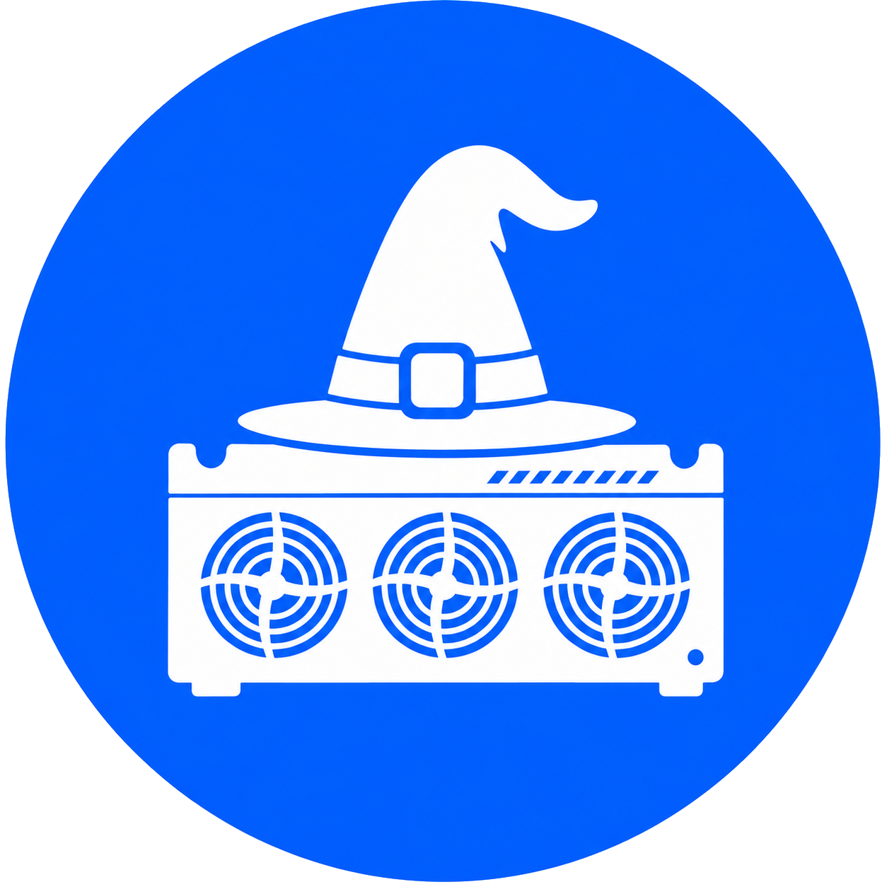

# 45Drives Storage Wizard — User Guide

Welcome to the **45Drives Storage Wizard** — the desktop application that takes a brand-new 45Drives server from the box to a fully configured, backed-up, off-site-replicated storage system.

This guide covers the entire journey end to end:

- The **Storage Wizard desktop app** (Windows, macOS, Linux) — your control centre
- The **Super Simple Setup wizard** — the server-side wizard that builds your storage pools and network shares
- **Remote Backups** — server-side backup tasks (Rsync, Cloud, ZFS) managed through the Task Scheduler
- **WireShield** — encrypted server-to-server tunnels for off-site backups

---

## How the Pieces Fit Together

The Storage Wizard is a desktop app that talks to your server over SSH and embeds the server's own web tools directly inside the app window. You almost never need to open a browser or type a URL.

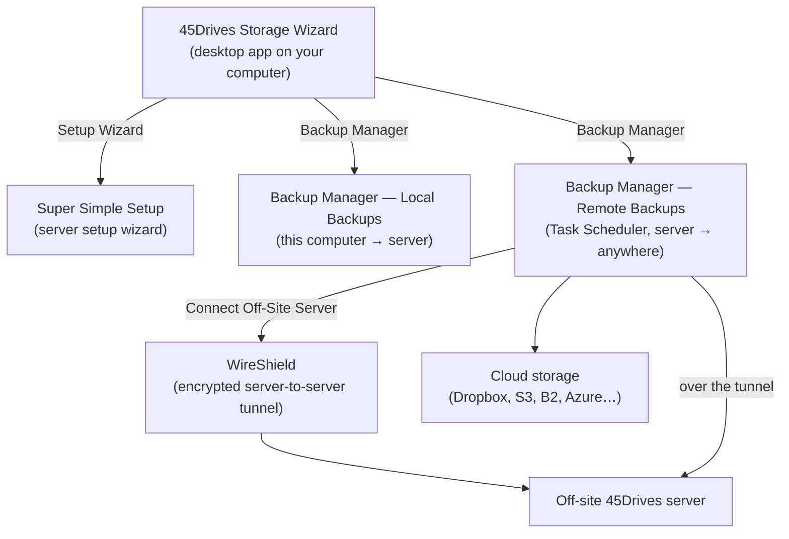
```mermaid
flowchart TD
    A["45Drives Storage Wizard<br/>(desktop app on your computer)"]
    B["Super Simple Setup<br/>(server setup wizard)"]
    C["Backup Manager — Local Backups<br/>(this computer → server)"]
    D["Backup Manager — Remote Backups<br/>(Task Scheduler, server → anywhere)"]
    E["WireShield<br/>(encrypted server-to-server tunnel)"]
    F["Cloud storage<br/>(Dropbox, S3, B2, Azure…)"]
    G["Off-site 45Drives server"]

    A -->|Setup Wizard| B
    A -->|Backup Manager| C
    A -->|Backup Manager| D
    D -->|Connect Off-Site Server| E
    D --> F
    E --> G
    D -->|over the tunnel| G
```

| Component | Where it runs | What it does |
|---|---|---|
| **45Drives Storage Wizard** | Your computer | Discovery, setup, backup management, restore, logs |
| **Super Simple Setup** | The server | Builds ZFS pools, datasets, users, and Samba shares |
| **Task Scheduler** | The server | Runs scheduled server-side backups (Rsync, Cloud, ZFS) |
| **WireShield** | The server | Creates the encrypted WireGuard tunnel to a second site |

> **Note:** The Storage Wizard opens the server-side tools inside its own window. When this guide says "the Remote Backups tab," you are looking at the server's Task Scheduler rendered inside the desktop app.

---

## Table of Contents

1. [System Requirements](#1-system-requirements)
2. [Installation](#2-installation)
   - [Windows](#windows)
   - [macOS](#macos)
   - [Linux](#linux)
3. [First Launch — The Dashboard](#3-first-launch--the-dashboard)
   - [Status Strip](#status-strip)
   - [Saved Servers](#saved-servers)
   - [Quick Actions](#quick-actions)
   - [Topology Map](#topology-map)
   - [Recent Activity and Upcoming Backups](#recent-activity-and-upcoming-backups)
4. [The Menu — Navigation, Themes, Logs, and Settings](#4-the-menu--navigation-themes-logs-and-settings)
   - [Settings](#settings)
   - [The Settings Footer](#the-settings-footer)
5. [Setting Up a New Server — The Setup Wizard](#5-setting-up-a-new-server--the-setup-wizard)
   - [Step 1: Welcome](#step-1-welcome)
   - [Step 2: Unboxing](#step-2-unboxing)
   - [Step 3: Plug-In Power](#step-3-plug-in-power)
   - [Step 4: Plug-In Ethernet](#step-4-plug-in-ethernet)
   - [Step 5: Power On](#step-5-power-on)
   - [Step 6: Discovered 45Drives Servers](#step-6-discovered-45drives-servers)
6. [Super Simple Setup — Configuring the Server](#6-super-simple-setup--configuring-the-server)
   - [Choose Setup — Simple or Custom](#choose-setup--simple-or-custom)
   - [Simple Path](#simple-path)
   - [Custom Path](#custom-path)
   - [Applying the Configuration](#applying-the-configuration)
7. [Bulk Server Setup](#7-bulk-server-setup)
8. [Server Management](#8-server-management)
   - [The Tabs](#the-tabs)
   - [Staged Changes](#staged-changes)
   - [VPN Tunnels](#vpn-tunnels)
9. [Manage Connections — The Credential Vault](#9-manage-connections--the-credential-vault)
10. [The Backup Manager](#10-the-backup-manager)
11. [Local Backups — This Computer to the Server](#11-local-backups--this-computer-to-the-server)
    - [Step 1: Create Backup Task](#step-1-create-backup-task)
    - [Step 2: Samba Login](#step-2-samba-login)
    - [Step 3: Summary](#step-3-summary)
    - [Step 4: Congratulations](#step-4-congratulations)
    - [Managing Local Backup Tasks](#managing-local-backup-tasks)
12. [Remote Backups — Server-Side Scheduled Tasks](#12-remote-backups--server-side-scheduled-tasks)
    - [Two Toolbars](#two-toolbars)
    - [Connecting to a Server](#connecting-to-a-server)
    - [The Backup Task List](#the-backup-task-list)
    - [Creating a Backup Task](#creating-a-backup-task)
    - [Choosing a Backup Type](#choosing-a-backup-type)
      - [Parameters — File Copy / Sync (Rsync)](#parameters--file-copy--sync-rsync)
      - [Parameters — Cloud Backup](#parameters--cloud-backup)
      - [Parameters — ZFS Backup (Server-to-Server)](#parameters--zfs-backup-server-to-server)
    - [Setting the Schedule](#setting-the-schedule)
    - [Running, Stopping, and Watching Progress](#running-stopping-and-watching-progress)
    - [Editing, Disabling, and Deleting Tasks](#editing-disabling-and-deleting-tasks)
    - [Viewing Logs](#viewing-logs)
    - [Remote Backup Settings](#remote-backup-settings)
13. [Cloud Accounts](#13-cloud-accounts)
    - [Supported Providers](#supported-providers)
    - [Adding an Account with Sign-In (OAuth)](#adding-an-account-with-sign-in-oauth)
    - [Adding an Account with Keys](#adding-an-account-with-keys)
    - [Editing and Removing Accounts](#editing-and-removing-accounts)
14. [Off-Site Backups with WireShield](#14-off-site-backups-with-wireshield)
    - [What WireShield Does](#what-wireshield-does)
    - [Before You Start — Ports and Firewalls](#before-you-start--ports-and-firewalls)
    - [Check This Server](#check-this-server)
    - [Pairing Two Servers](#pairing-two-servers)
    - [Managing Off-Site Connections](#managing-off-site-connections)
    - [Using the Tunnel in a Backup Task](#using-the-tunnel-in-a-backup-task)
15. [Restoring Data](#15-restoring-data)
    - [Restoring from a Local Backup](#restoring-from-a-local-backup)
    - [Restoring from a Remote Backup](#restoring-from-a-remote-backup)
    - [Snapshots](#snapshots)
16. [Automatic Updates](#16-automatic-updates)
17. [Viewing Logs](#17-viewing-logs)
18. [Frequently Asked Questions](#18-frequently-asked-questions)
19. [Troubleshooting](#19-troubleshooting)

---

## 1. System Requirements

### Desktop App — 45Drives Storage Wizard

| Component | Minimum | Recommended |
|---|---|---|
| **OS** | Windows 10 64-bit, macOS 11+ (Intel or Apple Silicon), Linux with a desktop environment | Windows 11, macOS 13+, Ubuntu 22.04+ / Rocky 9 |
| **CPU** | Dual-core x86_64 or Apple Silicon | 4+ cores |
| **RAM** | 4 GB | 8 GB |
| **Disk** | 500 MB for the app | 500 MB, plus working space for restores you download locally |
| **Display** | 800 × 600 (the window's minimum size) | 1440 × 900 or larger — the Backup Manager and Setup Wizard use wide layouts |
| **Network** | Wired or wireless LAN access to the server | Gigabit wired LAN for large backups |

> **Note:** The app is built on Electron, so any computer that runs a modern browser will run the Storage Wizard.

### Server — 45Drives Storage Server

| Component | Requirement |
|---|---|
| **OS** | Rocky Linux 8/9, Ubuntu 20.04/22.04, or Debian (Bookworm/Trixie) |
| **Management UI** | Cockpit (installed automatically during setup) |
| **Drives** | At least 2 drives for a mirror; 3+ for RAID-Z1, 4+ for RAID-Z2, 5+ for RAID-Z3. **6+ drives required to enable a split Storage/Backup pool** |
| **Network** | Connected to a router or switch on the same network as your computer for initial setup |
| **Access** | An account with root or sudo privileges |

### Software Installed on the Server During Setup

The Storage Wizard installs and configures these automatically when you connect for the first time:

| Package | Purpose |
|---|---|
| **cockpit** / **cockpit-bridge** | The server's web management interface |
| **45Drives Super Simple Setup** | The storage setup wizard |
| **45Drives Task Scheduler** | Scheduled server-side backup tasks |
| **WireShield** | Encrypted server-to-server tunnels |
| **zfsutils / zfs** | Storage pools and datasets |
| **samba** | Windows/macOS network file shares |
| **rsync** | File copy and sync backups |
| **rclone** | Cloud storage backups |
| **wireguard-tools** | VPN tunnel networking |
| **nfs-kernel-server / nfs-utils** | Optional NFS export support |

---

## 2. Installation

Download the latest version from the **[Releases page](https://github.com/45Drives/houston-client-manager/releases)**. Under **Assets** on the newest release, pick the file that matches your operating system.

### Windows

| File to Download |
|---|
| `45Drives-Storage-Wizard-<version>-win-x64.exe` |

1. Double-click the downloaded `.exe`.
2. The installer lets you choose where to install. Accept the default or pick your own folder.
3. Finish the wizard and launch **45Drives Storage Wizard** from the Start Menu or the desktop shortcut.

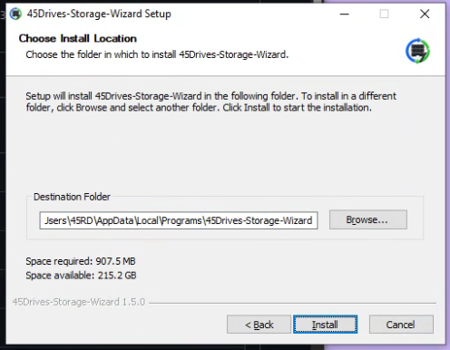
<!-- SCREENSHOT: The NSIS installer window on the "Choose Install Location" page, showing the 45Drives branding and the default install path. -->

> **Tip:** The installer is per-user and does not require administrator rights. Windows SmartScreen may show a warning the first time — choose **More info → Run anyway**.

### macOS

| Chip | File to Download |
|---|---|
| Apple Silicon (M1/M2/M3/M4) | `45Drives-Storage-Wizard-<version>-mac-arm64.dmg` |
| Intel | `45Drives-Storage-Wizard-<version>-mac-x64.dmg` |
| Either | `45Drives-Storage-Wizard-<version>-mac-universal.dmg` |

1. Double-click the `.dmg`.
2. Drag **45Drives Storage Wizard** into the **Applications** folder.
3. Launch it from Applications or Launchpad.

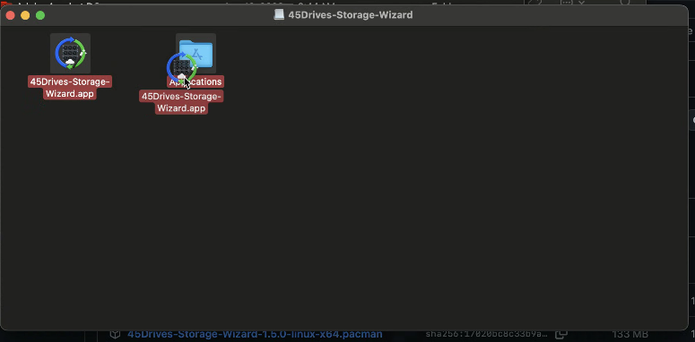
<!-- SCREENSHOT: The mounted .dmg window showing the 45Drives Storage Wizard icon and the arrow pointing at the Applications folder alias. -->

> **Important:** If you plan to create **Local Backups** on macOS, you will need to grant scheduled backups (cron) **Full Disk Access** under **System Settings → Privacy & Security → Full Disk Access**. The app reminds you of this on the backup Summary screen.

### Linux

| Distribution | File | Install Command |
|---|---|---|
| Ubuntu / Debian | `45drives-setup-wizard_<version>_amd64.deb` | `sudo apt install ./45drives-setup-wizard_<version>_amd64.deb` |
| Rocky / RHEL / Fedora | `45drives-setup-wizard-<version>.x86_64.rpm` | `sudo dnf install ./45drives-setup-wizard-<version>.x86_64.rpm` |
| Arch / Manjaro | `45drives-setup-wizard-<version>.pacman` | `sudo pacman -U 45drives-setup-wizard-<version>.pacman` |

Launch the app from your desktop application menu once installation completes.

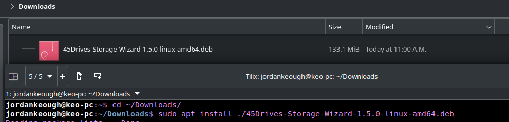
<!-- SCREENSHOT: The 45Drives Storage Wizard entry in a Linux desktop application menu (GNOME Activities or similar), showing the app icon and name. -->

> **Note:** On Linux, the first time you schedule a **Local Backup** you will be prompted for your administrator password so the app can install the cron entries.

---

## 3. First Launch — The Dashboard

When you open the app you land on the **Dashboard**. The window title shows the app name and version — for example, *45Drives Storage Wizard v1.4.0*.

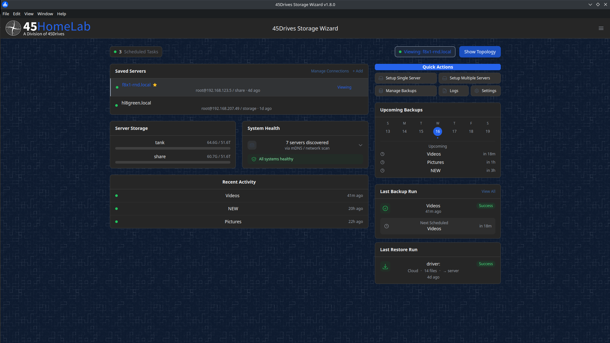
<!-- SCREENSHOT: Full app window on the Dashboard with at least one saved server, a couple of scheduled tasks, and the Quick Actions sidebar visible. Window title bar showing "45Drives Storage Wizard v1.4.0" should be included. -->

### Status Strip

Across the top of the main column:

- **`X Scheduled Tasks`** — a green dot and the number of backup tasks currently scheduled.
- **`Y Failed`** — a red dot and the number of tasks that failed recently. This only appears when there are failures.
- **Viewing: `<server name>`** — the server whose details are currently shown, or *"Select a server to view details"*.
- **Show Topology / Hide Topology** — toggles the backup network map.

If any tasks have failed, an alert banner appears: *"N backup tasks failed recently."* with a **View Backups** button that jumps straight to the Backup Manager.

### Saved Servers

The **Saved Servers** card lists your saved servers, five at a time. Each row shows a reachability dot (green online, grey offline), the server's name, a gold star if it is a favourite, and `username@host` with the share name and when it was last used.

Two buttons sit in the card header:

| Button | What it does |
|---|---|
| **Manage Connections** | Opens the credential vault (saved logins) |
| **+ Add** | Adds a server manually by IP address |

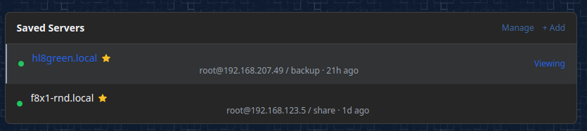
<!-- SCREENSHOT: The Saved Servers card with two or three servers listed (status dot, name, favourite star, username@host subtitle), the Manage Connections and + Add buttons in the header, and one row hovered so its gear icon is visible. -->

The card works three ways:

| Action | Result |
|---|---|
| **Single-click a row** | Selects that server, so the Storage, System Health, and Recent Activity panels show its details. The row is marked **Viewing**. |
| **Gear icon** (hover a row) | Opens that server's **Server Management** page |
| **Double-click a row** | Also opens **Server Management** |

If any saved logins have gone unused for 30 days or more, an amber banner at the bottom of the card names them and points you at **Manage Connections**.

Below Saved Servers, the **Storage** and **System Health** cards summarise capacity usage and overall server health for the selected server.

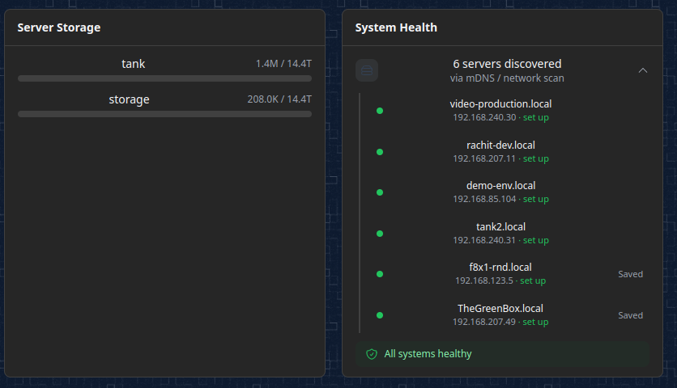
<!-- SCREENSHOT: The two side-by-side cards showing pool capacity usage (bar or donut) and the system health summary for a connected server. -->

### Quick Actions

The sidebar on the right leads with **Quick Actions**:

| Button | Destination |
|---|---|
| **Setup Single Server** | The Setup Wizard (one server, guided end to end) |
| **Setup Multiple Servers** | Bulk Server Setup |
| **Manage Backups** | The Backup Manager |
| **Logs** | The log viewer |
| **Settings** | The Settings modal |

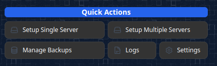
<!-- SCREENSHOT: The right-hand sidebar showing the "Quick Actions" heading with the primary-coloured badge and the five buttons in their 2-column grid. -->

### Topology Map

**Show Topology** draws a live map of your backup network: this computer, your servers, cloud destinations, and any WireShield tunnels between sites. Every tunnel you create shows up here, which makes it the fastest way to confirm an off-site link is live.

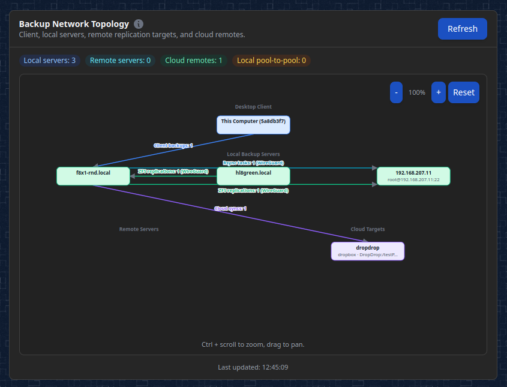
<!-- SCREENSHOT: The expanded topology map with this computer, at least two servers, a cloud destination node, and a WireShield tunnel link drawn between two sites. -->

### Recent Activity and Upcoming Backups

- **Recent Activity** is a table of your most recent backup runs. A green dot means success, red means failure, and a spinning icon means the task is running right now.
- **Upcoming Backups** in the sidebar is a mini week calendar showing what is scheduled next.
- **Last Backup** and **Last Restore** cards show the most recent of each.
- **Getting Started** appears until you have completed the basic onboarding steps, and disappears afterwards.

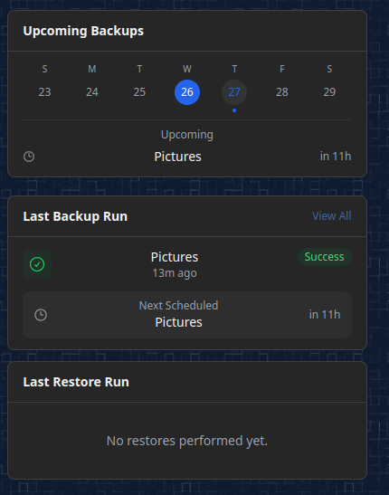
<!-- SCREENSHOT: Side-by-side crop of the Recent Activity table (mixed green success and red failure dots, plus one spinning "running" row) and the Upcoming Backups mini week calendar in the sidebar. -->

---

## 4. The Menu — Navigation, Themes, Logs, and Settings

The hamburger button (☰) in the top-right corner opens the app menu.

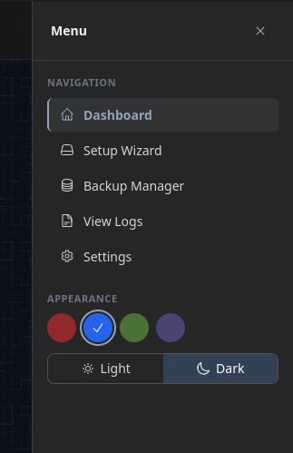
<!-- SCREENSHOT: The slide-out menu panel open, showing the "Menu" header, the Navigation section with all five items (Dashboard, Setup Wizard, Backup Manager, View Logs, Settings) and the Appearance section below it. -->

**Navigation**

| Item | Opens |
|---|---|
| **Dashboard** | The main dashboard |
| **Setup Wizard** | The new-server setup flow |
| **Backup Manager** | Local and Remote backups |
| **View Logs** | The log viewer modal |
| **Settings** | The Settings modal |

**Appearance**

Four theme swatches change the app's colour scheme to match your 45Drives product line:

| Theme | Colour |
|---|---|
| **45Drives** | Red |
| **45Homelab** | Blue |
| **45Pro** | Green |
| **45Studio** | Purple |

A **Light / Dark** toggle sits beside them. Your choice is remembered between sessions and is also passed through to the server tools embedded in the app, so everything matches.

### Settings

The Settings modal is organised into four sections:

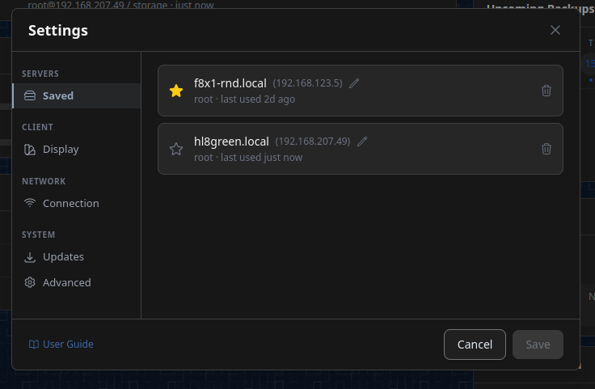
<!-- SCREENSHOT: The Settings modal open on the Servers > Saved section, with the left-hand nav showing all four groups (Servers, Client, Network, System) and their items. -->

**Servers → Saved**

Your saved servers. For each one you can:

- Mark it as a **favorite** (star icon) so it appears at the top of dropdowns
- Give it a **display name** (click the pencil, type a name, click **Save**)
- **Remove** it from the saved list

**Client → Display**

| Setting | Description |
|---|---|
| **Server display format** | How servers appear in dropdowns and lists — *Hostname only*, *IP only*, or both |
| **Show notification toasts** | Display in-app notifications for backup events |
| **Guided tours** | Show step-by-step guided tours for new features and views |
| **Reset guided tours** | Re-show all onboarding walkthroughs and welcome screens |

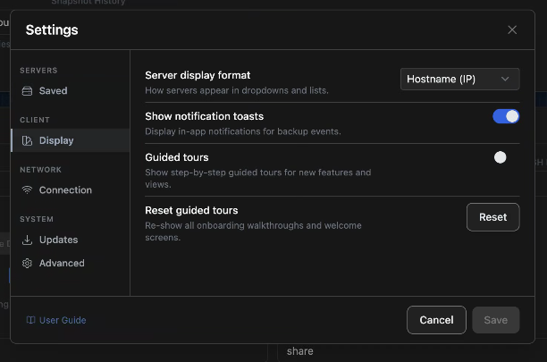
<!-- SCREENSHOT: The Client > Display panel showing all four rows: the Server display format dropdown, the notification toasts and guided tours toggles, and the Reset guided tours button. -->

**Network → Connection**

| Setting | Description | Range |
|---|---|---|
| **Auto-connect favorites** | Automatically connect when a favorite server is selected | On / Off |
| **SSH Connection timeout** | Seconds to wait when connecting to a server | 5–120 seconds |
| **Fast SSH ciphers** | Use AES-128-GCM for faster LAN transfers (requires AES-NI on both ends) | On / Off |
| **Fallback network scan** | Scan the network when automatic discovery fails | On / Off |

Below these, a **Discovery Timing** group holds two more values:

| Setting | Description | Range |
|---|---|---|
| **Scan interval** | How often the app re-scans the network for servers | 2–60 seconds |
| **Inactivity timeout** | How long a server may go unseen before it drops off the discovered list | 10–600 seconds |

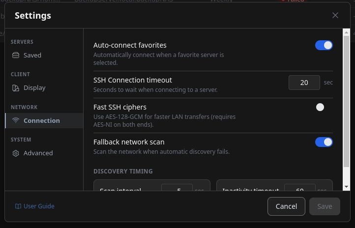
<!-- SCREENSHOT: The Network > Connection panel showing the four setting rows with their toggles and inputs, plus the "Discovery Timing" heading below with the Scan interval and Inactivity timeout number fields. -->

**System → Advanced**

| Setting | Description | Range |
|---|---|---|
| **Log retention** | How long to keep log files before they are cleaned up | 1–365 days |

**Reset All Settings** sits at the bottom of this panel and returns every preference to its default — *"This resets all preferences to their defaults. Saved servers are not affected."*

### The Settings Footer

A footer runs along the bottom of the modal. **Unsaved changes** appears on the left the moment you alter anything, and **Save** stays disabled until then. **Cancel** closes without applying. A **User Guide** link opens this document on GitHub in your browser.

> **Tip:** If discovery never finds your server, turn on **Fallback network scan**. Automatic discovery uses mDNS, which some networks block.

---

## 5. Setting Up a New Server — The Setup Wizard

Click **Setup Single Server** from Quick Actions, or **Setup Wizard** from the menu. This flow walks you through the physical setup of the hardware and then hands off to the server's own configuration wizard.

Every step has **Back** and **Next** buttons at the bottom.

> **Tip:** Anywhere you see the **?** icon, hover your mouse over it — Houston Commander, the built-in helper, has extra guidance for that field.

### Step 1: Welcome

*"Welcome to the 45Drives Setup Wizard!"*

An introduction explaining that balancing capacity, performance, and redundancy is complicated, and that this wizard applies 45Drives' best practices for you. Click **Next**.

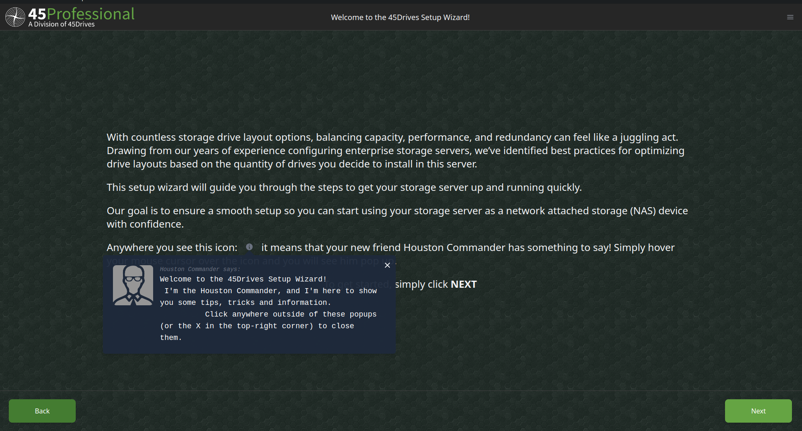
<!-- SCREENSHOT: The Welcome step with the full intro text, the Houston Commander helper icon visible, and the Back / Next buttons at the bottom. -->

### Step 2: Unboxing

*"Unboxing"*

Insert your drives into the chassis.

- Drives purchased from 45Drives arrive in a separate, securely packaged box.
- If you are supplying your own drives, use drives of the same capacity wherever possible.
- The storage bays are **caddiless for 3.5" drives**. 2.5" drives can be used, but they **require caddies**.

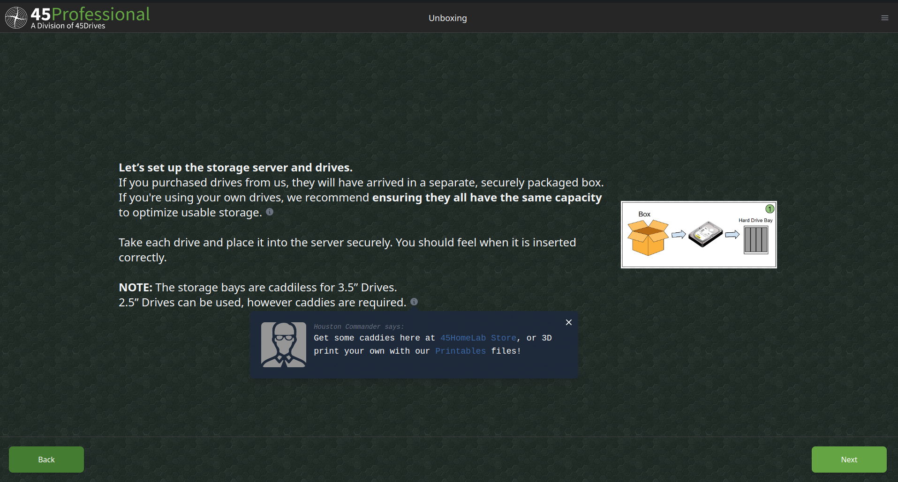
<!-- SCREENSHOT: The Unboxing step showing the "Insert Drives" diagram illustration and the caddiless-bay note. -->

### Step 3: Plug-In Power

*"Plug-In Power"*

Connect the supplied power cord to the power port on the back of the server, then to a wall outlet — or, better, to a UPS.

> **Tip:** A UPS protects the server from sudden shutdowns caused by power loss or fluctuation, which is the single most common cause of storage corruption.

### Step 4: Plug-In Ethernet

*"Plug-In Ethernet"*

Connect the supplied Ethernet cable from the back of the server to a **router or network switch**.

> **Important:** This is a Network Attached Server (NAS), not a Direct Attached Server (DAS). Connecting the server directly to a computer will not work.

### Step 5: Power On

*"Power On"*

Press the power button on the server. Give it a minute or two to boot before continuing.

### Step 6: Discovered 45Drives Servers

*"Select a 45Drives Server to Setup"*

This screen has two halves.

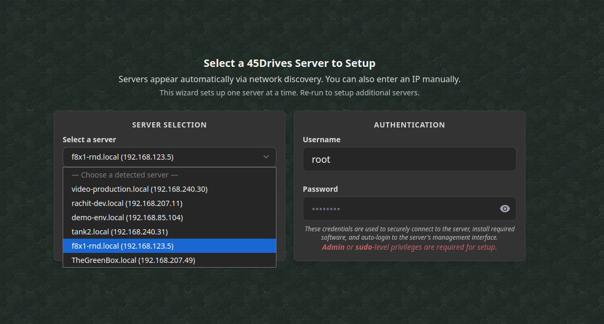
<!-- SCREENSHOT: The full discovery step showing both columns: on the left the "Select a server" dropdown expanded with discovered entries in "ServerName (IP)" format, the "Connect manually via IP" field and Rescan Servers button; on the right the Username and Password fields with the eye toggle and the credentials note. -->

**Left — finding the server**

| Field | What to do |
|---|---|
| **Select a server** | Choose your server from the dropdown. Entries appear as *ServerName (IP)*. If nothing is listed yet, wait a moment and click **Rescan Servers**. |
| **Connect manually via IP** | If the server never appears, type its IP address here (for example `192.168.1.123`). |
| **Rescan Servers** | Searches the network again |
| **Start Over** | Returns to the beginning of the wizard |

**Right — signing in**

| Field | What to do |
|---|---|
| **Username** | The server login. Defaults to `root`. |
| **Password** | The password for that account. Use the eye icon to reveal what you typed. |

> **Note:** These credentials are used to securely connect to the server, install the required software, and automatically log you into the server's management interface. An account with admin or sudo-level privileges is required.

Click **Next**. The button changes to **Installing…** while the app connects over SSH and installs the server components. Status messages appear as it works. If something goes wrong, a **Troubleshooting steps** section appears with a **?** icon you can hover for details.

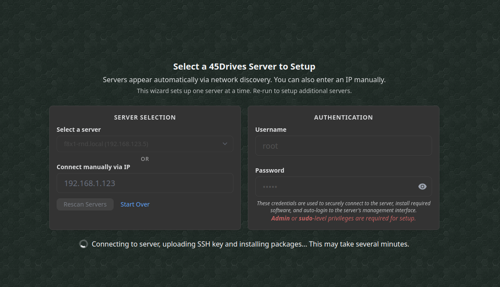
<!-- SCREENSHOT: The discovery step mid-install: the Next button showing "Installing…", a spinner and a progress status message. If possible, a second variant showing the "Troubleshooting steps" error state. -->

When installation finishes, the app opens the server's **Super Simple Setup** wizard directly inside the app window.

---

## 6. Super Simple Setup — Configuring the Server

This is the server-side wizard that actually builds your storage. It runs inside the Storage Wizard window, so it looks and behaves like part of the app.

### Choose Setup — Simple or Custom

*"Set Up Your Server"* — "Choose how you'd like to set up your storage server."

Two cards are presented:

| Card | Badge | Description |
|---|---|---|
| **SIMPLE** | Recommended | "Quick and effortless. Let the wizard configure your storage using 45Drives' best practices based on the drives installed." *Great for beginners.* |
| **CUSTOM** | Advanced | "Full control over ZFS pools, datasets, Samba shares, users, and groups. Fine-tune every aspect of your server configuration." *For advanced users.* |

Below the cards, **Learn About Our Best Practice Storage Architecture** explains how ZFS, Samba, and client backups fit together, with a **Watch the Video** button.

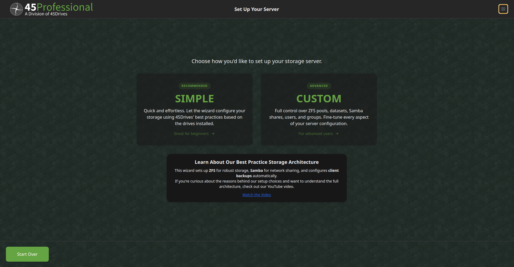
<!-- SCREENSHOT: The "Set Up Your Server" screen with both cards side by side — SIMPLE with its "Recommended" badge and CUSTOM with its "Advanced" badge — plus the best-practice learning section and Watch the Video button underneath. -->

Choose **SIMPLE** unless you have a specific reason to override the defaults. The Simple path produces a correctly configured, production-ready server.

---

### Simple Path

The Simple path is four steps: Credentials → Drives → Summary → Complete.

#### Simple Step 1: Storage Server Set Up

*"Enter your server information below."*

> **Important:** Save the **Server Name**, **Network Folder Name**, **Username**, and **Password** somewhere safe before continuing. These are essential for accessing your storage server, and they cannot be recovered later.

| Field | Rules |
|---|---|
| **Server Name** | The name your server is known by on the network. Letters, numbers, and dashes only — no spaces or special characters. Cannot start or end with a hyphen. Maximum 63 characters. Leave blank to keep the current hostname. |
| **User Name** | The admin user that will access your storage. Lowercase letters and numbers only, no spaces. Cannot be a reserved name (`root`, `admin`, `guest`, `daemon`, and similar) or an account that already exists. |
| **Password** | Minimum 8 characters, and must include one uppercase letter, one number, and one special symbol (`!@#$%^` etc). |
| **Confirm Password** | Must match exactly. |
| **Use the same password for root account?** | Checked by default. When checked, the root password matches your storage password. Remote root login is disabled by default for security. |
| **Root Password** / **Confirm Root Password** | Only shown when the checkbox above is unchecked. Same strength rules. |
| **Network Folder Name** | The name of your shared folder (the "share"). Letters, numbers, dashes, and underscores only — no spaces. |

A live **Folder Preview** shows exactly how the share will appear in Windows File Explorer — for example `\\myserver.local\data`.

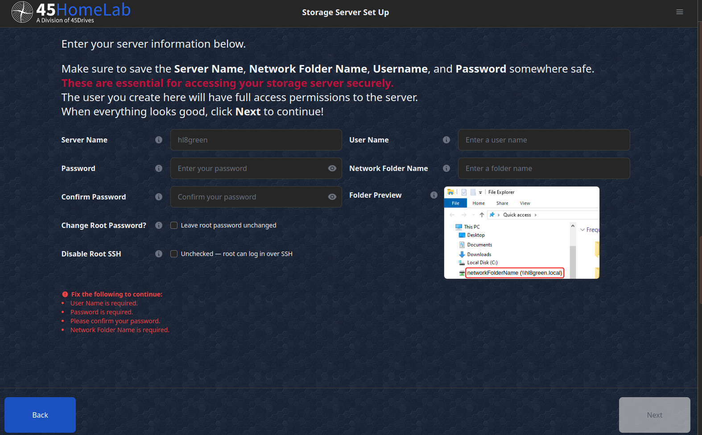
<!-- SCREENSHOT: The "Storage Server Set Up" step with all fields filled in: Server Name, User Name, Password and Confirm Password (masked, eye icons visible), the "Use the same password for root account?" checkbox ticked, Network Folder Name, and the Folder Preview graphic showing \\servername.local\foldername. -->

When you click **Next**, a confirmation dialog appears reminding you to save your credentials — **especially the root password**. Click **OK, Proceed** if you have already recorded them, or **Back** to go store them first.

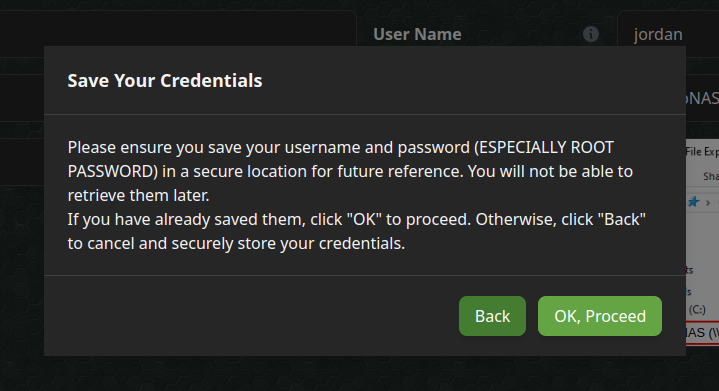
<!-- SCREENSHOT: The modal warning the user to save their username, password and especially the root password, with the "OK, Proceed" and "Back" buttons. -->

#### Simple Step 2: Storage Drive Summary

*"Based on the quantity of storage drives you installed in the server, we will setup the storage array with a balance of capacity, performance, and redundancy."*

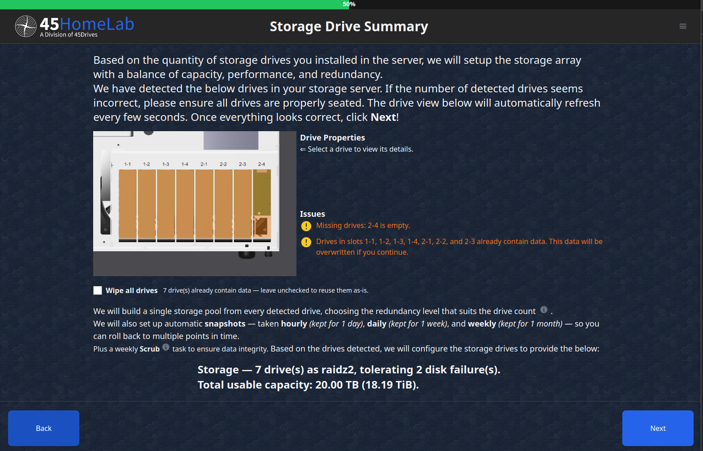
<!-- SCREENSHOT: The full Storage Drive Summary step: the 3D chassis drive canvas on the left with one drive selected/highlighted, the Drive Properties panel populated on the right, the green "No issues found." Issues panel, the Split Pools checkbox, and the capacity table showing failure tolerance and usable space. -->

**Left panel — the drive view.** A 3D representation of your chassis with every drive bay. Click a drive to inspect it. The view refreshes automatically every few seconds, so if a drive is missing, reseat it and watch it appear.

**Right panel — Drive Properties and Issues.**

- **Drive Properties** shows the selected drive's model, serial, capacity, type (HDD/SSD), health, rotation rate, and firmware. If nothing is selected it prompts *"⇐ Select a drive to view its details."*
- **Issues** shows *"No issues found."* in green when everything is healthy, or lists warnings — missing drives, size mismatches, or health problems — along with the affected slot IDs.

**Wipe all drives.** If any drive contains existing data, a **Wipe all drives** checkbox appears with a summary of the wipe method and slot count. Click **Change method** to choose:

| Method | Behaviour |
|---|---|
| **Full erase** | Every block on the drive is overwritten. Secure, but can run for **hours** on large hard drives and cannot be safely interrupted. |
| **Quick wipe** | Removes partition tables and filesystem signatures only. Fast. |

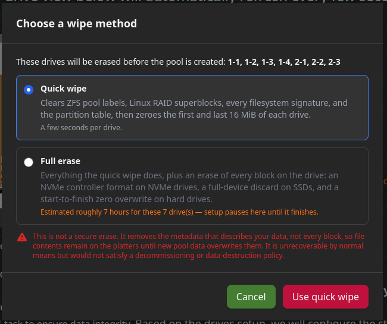
<!-- SCREENSHOT: The Wipe Method modal showing both options — Full erase and Quick wipe — with their descriptions and the confirm/cancel buttons. -->

**Active Backup (Split Pools).** Tick **Split Pools** to divide your drives into a Storage pool and a Backup pool. The Backup pool always holds a copy of your Storage pool, replicated with ZFS snapshots.

- Requires **at least 6 drives** so both pools keep redundancy. The checkbox is disabled below that.
- Snapshots are taken **hourly** (kept for 1 day), **daily** (kept for 1 week), and **weekly** (kept for 1 month), so you can restore from multiple points in time.
- If you have an odd number of drives, one is left out as a spare.
- Either way, a weekly **Scrub** task is scheduled to verify data integrity.

A capacity table below shows, for each pool, how many disk failures it will tolerate and how much usable space you get.

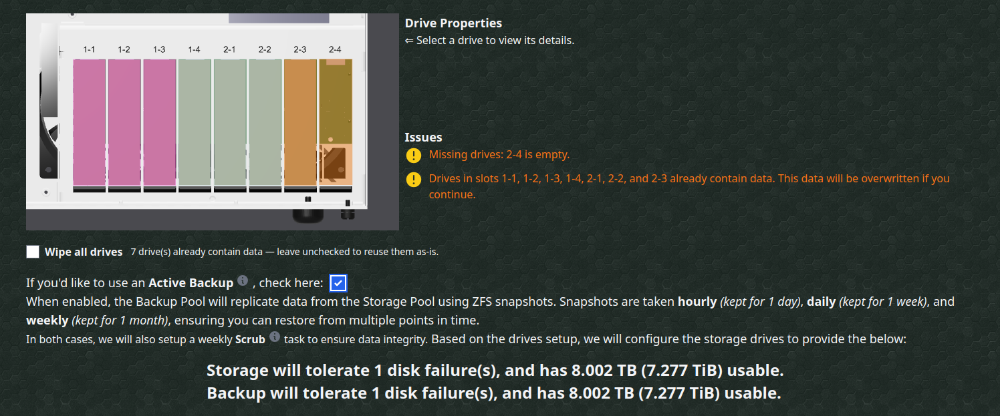
<!-- SCREENSHOT: Close crop of the Active Backup section with the Split Pools checkbox ticked, the snapshot-retention explanation text, and the capacity table showing both a Storage row and a Backup row with failure tolerance and usable capacity. -->

**Next** is disabled while any errors are present.

#### Simple Step 3: Summary

*"You're almost finished! A summary of information can be found below."*

The screen shows your configuration in columns:

- **System Summary** — Server Name, User Name, Password (hidden, with an eye icon to reveal), and Network Folder Name.
- **Samba Summary** — share name, path, permissions, and who has access.
- **Storage ZFS** — pool name, RAID type, drive count, usable capacity, dataset settings.
- **Backup ZFS** — the same for the backup pool, if you enabled Split Pools.

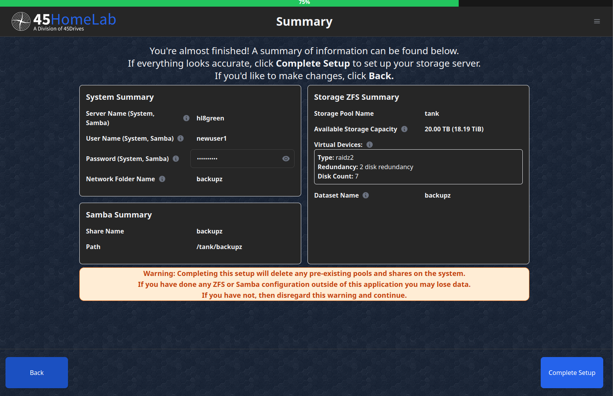
<!-- SCREENSHOT: The Summary step showing the three columns (System Summary with the masked password and eye toggle, the ZFS storage pool summary, and the backup pool summary) plus the orange data-loss warning banner at the bottom and the Complete Setup button. -->

> **Warning:** Completing this setup will delete any pre-existing pools and shares on the system. If you have done ZFS or Samba configuration outside of this application, you may lose data. If you have not, disregard this warning and continue.

Click **Complete Setup**.

---

### Custom Path

The Custom path is six steps and gives you control over every option. Choose it when you need specific RAID levels, extra datasets, additional users, or multiple Samba shares.

#### Custom Step 1: Server Info

*"Configure your server identity, admin credentials, and security settings."*

| Field | Notes | Default |
|---|---|---|
| **Server Name** | Hostname. Letters, numbers, dashes. Max 63 characters. | Current hostname |
| **Admin Username** | Lowercase letters, numbers, underscores, dashes. Max 32 characters. Cannot be reserved or already in use. | — |
| **Admin Password** / **Confirm Password** | 8+ characters with an uppercase letter, number, and symbol. | — |
| **Timezone** | Used for scheduling and log timestamps. | Auto-detect |
| **Disable Root SSH** | Security best practice. Your admin user can still use `sudo`. | Enabled |
| **Sync Time via NTP** | Keeps the server clock accurate automatically. | Enabled |

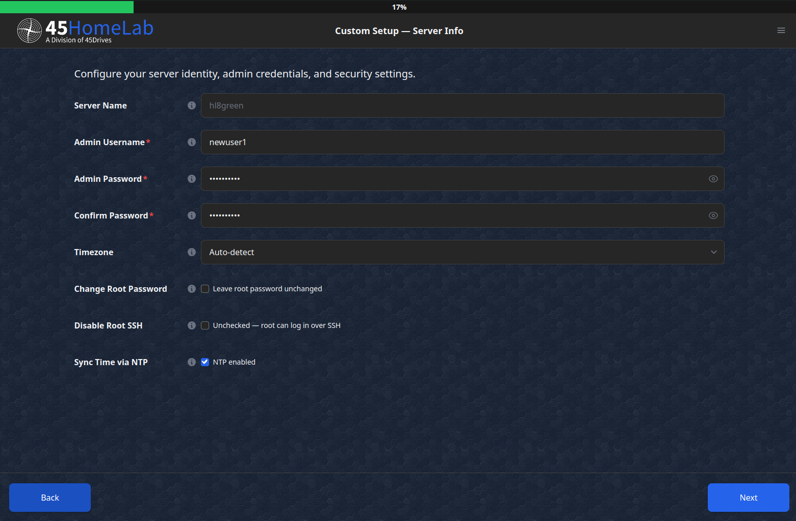
<!-- SCREENSHOT: The "Custom Setup — Server Info" step with the two-column field grid: Server Name, Admin Username, Admin Password + Confirm, the Timezone dropdown open, and the Disable Root SSH / Sync Time via NTP checkboxes both ticked. -->

#### Custom Step 2: ZFS Configuration

*"Configure your ZFS storage pool and dataset. Select drives, choose a RAID level, and set options."*

**RAID Level**

| Level | Minimum Drives | Failure Tolerance |
|---|---|---|
| **mirror** | 2 | Half the drives |
| **raidz1** | 3 | 1 drive |
| **raidz2** | 4 | 2 drives |
| **raidz3** | 5 | 3 drives |

**Enable Backup Pool** assigns some drives to a Storage pool and some to a Backup pool. Requires at least 6 drives. When enabled, a **Pool** column appears in the drive table so you can assign each drive to *Storage* or *Backup*.

**Drive Selection** uses the same 3D chassis view alongside a table showing slot, model, serial, capacity, type, and health. The heading tracks your progress: *"Select Drives (4 selected, minimum 3)"*. An **Issues** section lists any problems, and a **Wipe all drives** option is available exactly as in the Simple path.

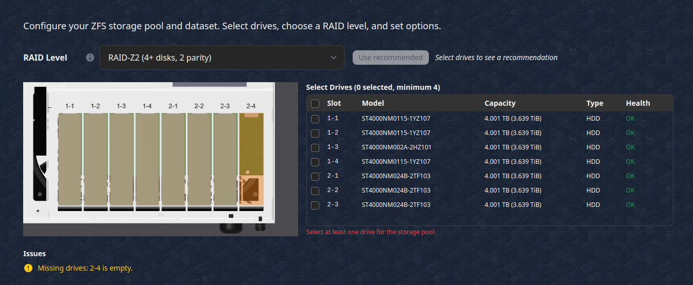
<!-- SCREENSHOT: The ZFS Configuration step showing the RAID Level dropdown, the "Enable Backup Pool" checkbox, the 3D chassis canvas beside the drive table with checkboxes and the Pool column (Storage/Backup) visible, and the "Select Drives (N selected, minimum M)" heading. -->

**Storage Pool options**

| Option | Description | Default |
|---|---|---|
| **Pool Name** | Root of your storage hierarchy | `tank` |
| **Auto-expand** | Grow the pool when larger disks are added | On |
| **Auto-replace** | Automatically replace failed drives if a spare exists | On |
| **Auto-trim (SSD)** | Enable TRIM. Not needed for HDDs. | Off |
| **Force create** | Create even if disks are in use. Use with caution. | Off |
| **Compression** | LZ4 (recommended), ZSTD, GZIP, Off | LZ4 |
| **Dedup** | Off (recommended), On, Verify | Off |
| **Record Size** | 4K – 1M | 128K |

**Dataset options**

| Option | Description | Default |
|---|---|---|
| **Name** | Also used as the default Samba share name | Your folder name |
| **Compression** | LZ4 (recommended), ZSTD, GZIP, Off | LZ4 |
| **Access Time** | Off (recommended) or On | Off |
| **Case Sensitivity** | Sensitive, Insensitive, Mixed | Sensitive |

If **Enable Backup Pool** is ticked, an identical section appears for the Backup pool, described as *"the active backup where your main storage pool will be replicated for safekeeping."*

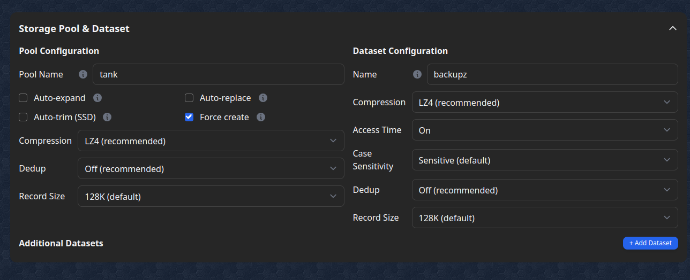
<!-- SCREENSHOT: The expanded Storage Pool and Dataset configuration panels showing Pool Name, the four toggles (auto-expand, auto-replace, auto-trim, force create), Compression / Dedup / Record Size dropdowns, and the dataset Name / Compression / Access Time / Case Sensitivity fields. -->

#### Custom Step 3: Users & Groups

*"Create users and groups for your server. The admin user from Step 1 is included automatically."*

**Groups** — click **+ Add Group** and enter a name. Lowercase letters, numbers, underscores, and dashes; max 32 characters; no duplicates.

**Users** — the admin user from Step 1 is shown with an **Admin** badge and is automatically added to `sudo` and `wheel`. Tick **Add to additional groups** to put it in more groups.

Click **+ Add User** for each additional account:

| Field | Notes |
|---|---|
| **Username** | Lowercase letters, numbers, underscores, dashes. Cannot duplicate an existing or reserved name. |
| **Password** | Optional |
| **Groups** | Tick any wizard-created group or existing system group |
| **SSH Public Key** | Optional. Must be a valid `ssh-rsa`, `ssh-ed25519`, `ssh-dss`, or `ecdsa-sha2-*` key. |

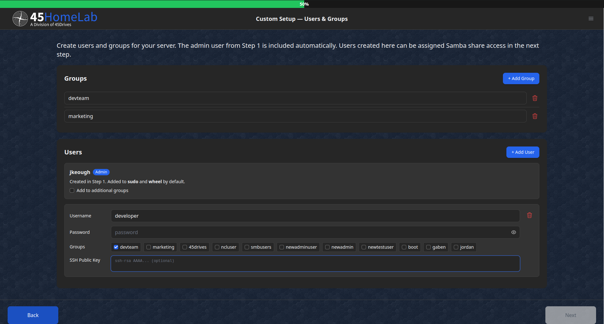
<!-- SCREENSHOT: The Users & Groups step showing the Groups section with two groups added and the "+ Add Group" button, the highlighted Admin user block with its "Admin" badge, and one additional user expanded showing Username, Password, group checkboxes, and the SSH Public Key textarea. -->

#### Custom Step 4: Samba Shares

*"Configure Samba (SMB) network shares. The primary share maps to your ZFS dataset for compatibility with backup/restore."*

**Shares.** The **Primary** share is created from your ZFS dataset and its name is locked. Click **+ Add Share** for more. Each share has:

- **Share Name**, **Path**, and **Description**
- Four toggles: **Guest access**, **Read only**, **Browseable**, **Inherit permissions**
- **Access** — tick **All users**, or untick it and pick specific **Users** and **Groups**

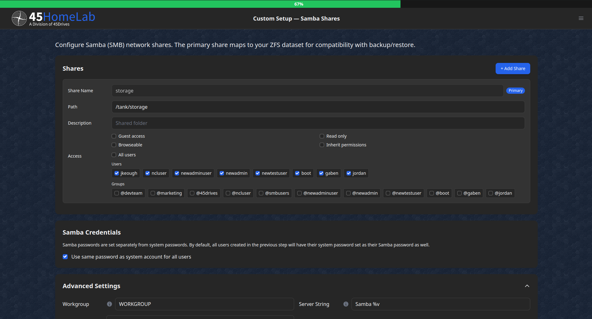
<!-- SCREENSHOT: The Samba Shares step showing the locked Primary share (with its "Primary" badge and disabled name field), one additional share below it, the four permission toggles, and the Access section with "All users" unticked so the user and group checkboxes are visible. -->

**Samba Credentials.** Samba passwords are separate from system passwords. By default, every user created in the previous step gets their system password set as their Samba password. Untick **Use same password as system account for all users** to manage them separately. Per-user Samba passwords can be set after setup through the Samba management interface.

**Advanced Settings** (collapsible)

| Setting | Description | Default |
|---|---|---|
| **Workgroup** | Windows workgroup or domain name | `WORKGROUP` |
| **Server String** | Description shown in the network browser. `%v` is replaced with the Samba version. | `Samba %v` |
| **Log Level** | 0 Minimal, 1 Normal, 2 Verbose, 3 Debug | 0 |

#### Custom Step 5: Summary

*"Review your configuration below."*

A full breakdown across columns: System (server name, admin user, password, timezone, root SSH, NTP), Users & Groups, Samba (workgroup, server string, log level, and each share), the Storage Pool (with expandable Drives, Pool Options, and Dataset panels), and the Backup Pool if enabled.

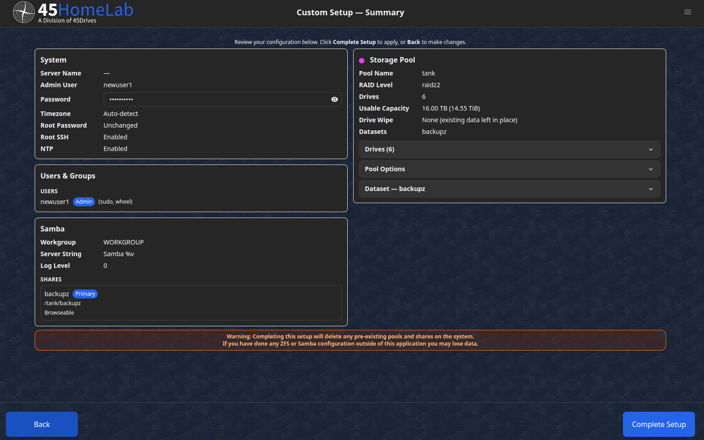
<!-- SCREENSHOT: The Custom Summary step with all three columns populated and at least one collapsible panel (e.g. "Drives" or "Pool Options") expanded, plus the orange data-loss warning banner and the Complete Setup button. -->

The same data-loss warning appears at the bottom. Click **Complete Setup** when you are satisfied.

---

### Applying the Configuration

*"Setting Up Server"*

The wizard now applies everything, showing a live checklist. Each row displays ✔ when complete, ◉ while running, and ✖ if it fails.

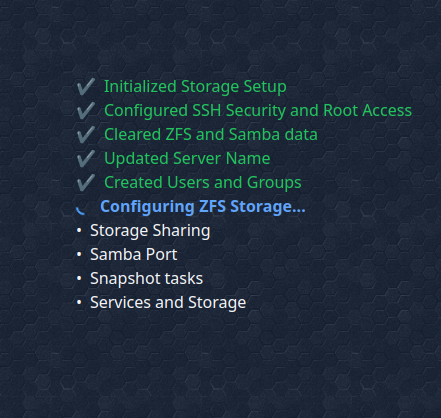
<!-- SCREENSHOT: The "Setting Up Server" screen mid-run: several steps ticked green, one step showing the active spinner, and the remaining steps greyed out as pending. -->

1. Initializing Storage Setup
2. Configuring SSH Security and Root Access
3. Clearing ZFS and Samba data
4. Updating Server Name
5. Creating Users and Groups
6. Configuring ZFS Storage
7. Configuring Storage Sharing
8. Opening Samba Port
9. Ensuring Node Version (18)
10. Scheduling Snapshot/Backup Tasks

If you chose to wipe drives, an **Erasing Selected Drives** step is inserted. With **Full erase** selected you will see a warning: *"Every block on the selected drives is being overwritten. This normally runs for hours on large hard drives and cannot be interrupted safely — leave this page open until it finishes."*

If you enabled Split Pools, the final step schedules the **Active Backup tasks**.

> **Important:** If you changed the Server Name, the server reboots after setup to finalise the hostname change. This is normal — wait a minute and reconnect.

**When setup completes**

*"You now have a network attached server that you can start using immediately."*

Two buttons finish the flow:

| Button | What it does |
|---|---|
| **Configure Backups** | Takes you to the Backup Manager |
| **Setup More Storage Servers** | Restarts the setup wizard for another server |

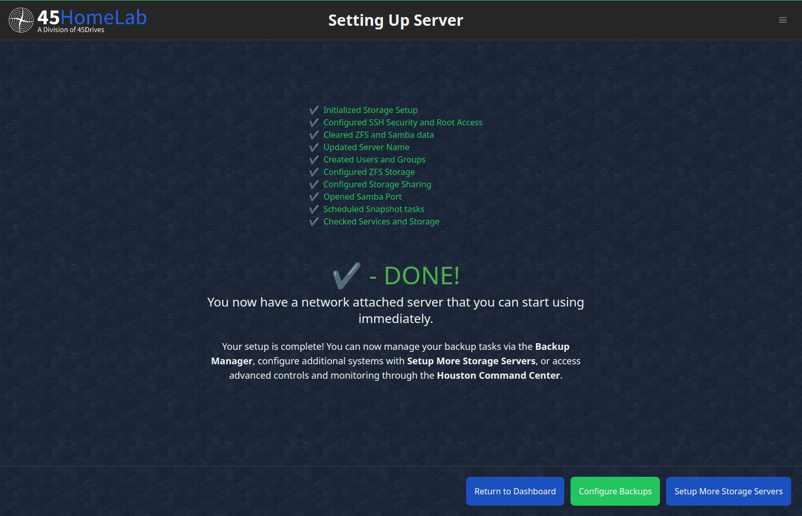
<!-- SCREENSHOT: The completed setup screen showing all steps ticked green, the success message, and the Configure Backups and Setup More Storage Servers buttons. -->

---

## 7. Bulk Server Setup

If you are deploying several servers at once, use **Setup Multiple Servers** from Quick Actions.

*"Bulk Server Setup — Configure and deploy multiple servers at once."*

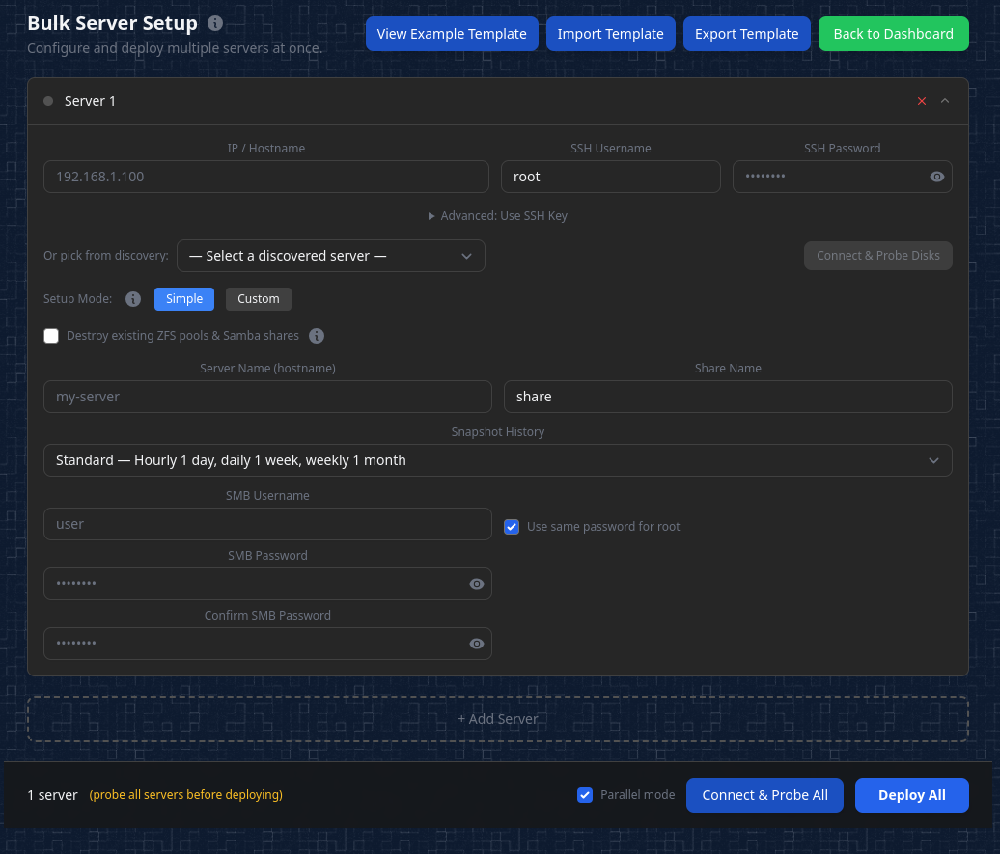
<!-- SCREENSHOT: The Bulk Server Setup page with three server cards added, the Import Template / Export Template buttons in the header, the "+ Add Server" dashed button, and the sticky action bar at the bottom showing the done / failed / currently-running counters. -->

**Global Defaults** (shown once you add more than one server) let you fill in values shared by every machine:

| Field | Purpose |
|---|---|
| **SSH Username** / **SSH Password** | Server login used for setup. Defaults to `root`. |
| **SMB Username** / **SMB Password** | The file-sharing account created on each server |
| **Authenticate with SSH private key** | Use a key instead of a password. Choose the key with **Browse…** and supply a **Key Passphrase** if the key has one. |
| **Quick-wipe drives that carry old partitions or signatures** | Clears leftover partition data before creating pools |

Click **Apply to all servers missing values** to push the defaults into every server card that has blank fields.

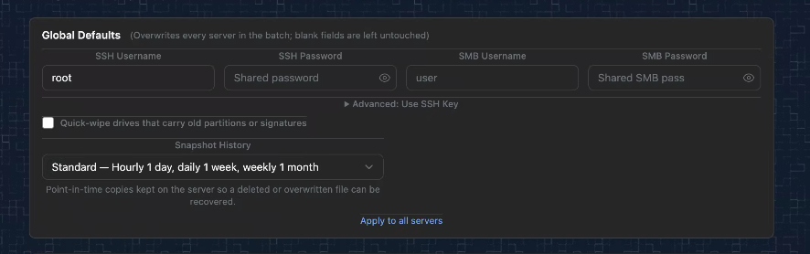
<!-- SCREENSHOT: The Global Defaults panel showing the SSH and SMB username/password fields, the expanded "Advanced: Use SSH Key" section with the key path, Browse button and passphrase field, the quick-wipe checkbox, and the "Apply to all servers missing values" button. -->

Use **+ Add Server** to add a card for each machine, and fill in whatever differs per server. A sticky action bar at the bottom tracks progress: total servers, how many are **done** (green), how many **failed** (red), and which one is currently running. A **Parallel mode** option runs several servers at once instead of one after another.

**Import Template** and **Export Template** let you save a bulk configuration to a JSON file and reuse it on your next deployment.

---

## 8. Server Management

Open a server's management page from the Dashboard by hovering its row in **Saved Servers** and clicking the **gear icon**, or by double-clicking the row. The header shows the server name, `username@host · ip`, and a status dot — green when online, grey when offline.

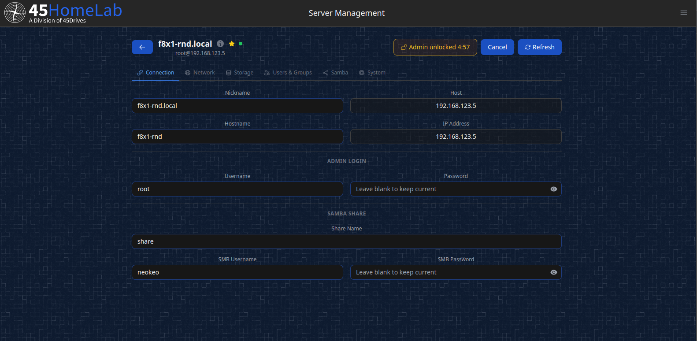
<!-- SCREENSHOT: The Server Management page for a connected server, showing the header with the name, username@host · ip subtitle and green status dot, the Edit and Refresh buttons, the full six-tab bar, and the Storage tab content. -->

| Control | Purpose |
|---|---|
| **Edit** | Switch into edit mode so fields become editable |
| **Cancel** | Leave edit mode |
| **Refresh** | Re-probe the server for its current state |

When you open the page it probes the server and shows *"Probing server…"*. If the probe fails you get the reason and a **Retry** button. If the server is rebooting after a hostname change, the tabs grey out and you see *"Server is rebooting… Waiting for `<name>` to come back online"* until it returns.

### The Tabs

Six tabs cover the whole server:

| Tab | What it shows |
|---|---|
| **Connection** | How *this app* reaches the server: Nickname, Host, Hostname, IP Address, the **Admin Login** (username and password), and the **Samba Share** details (share name, SMB username, SMB password) |
| **Network** | Hostname, every interface's IP address, DNS servers, **VPN Tunnels (WireGuard)**, and a **Backup Topology** map for this server |
| **Storage** | The ZFS pool and dataset layout with capacity. A link to **Advanced Storage Management (Houston) →** opens the server's full ZFS tools. |
| **Users & Groups** | System accounts and groups, with controls to add and remove them |
| **Samba** | Shares, their paths and access, plus per-user Samba passwords |
| **System** | OS and uptime, CPU model and core count, memory used and free, and a status dot for each detected service |

### Staged Changes

Editing here does not take effect immediately. As you change fields, a **Staged Changes** panel slides in from the right listing every pending edit with its old and new value, and a tag showing whether it applies **locally** (saved on this computer, such as a nickname or stored password) or on the **server** (such as the hostname).

Passwords are masked in the panel. Click the **✕** on any entry to drop that one change, then **Save N Changes** to apply the rest together, or **Discard All** to abandon them.

> **Important:** Changing the **Hostname** is a server-side change. The server reboots to finalise it, and the page waits for it to come back.

### VPN Tunnels

The **Network** tab lists each WireGuard interface with a **Connected** or **No handshake** badge, its listen port, the peer endpoint, and Rx/Tx byte counters. **Manage** opens the tunnel modal, **New Tunnel** starts pairing, and **Remove** (visible in edit mode) tears a tunnel down.

If the server does not have WireShield, you will see *"WireShield is not installed on this server."*

> **Tip:** WireShield tunnels can be created and managed from **Server Management → Network** as well as from inside a backup task. See [Off-Site Backups with WireShield](#14-off-site-backups-with-wireshield).

---

## 9. Manage Connections — The Credential Vault

Reached from **Manage Connections** on the Dashboard's Saved Servers card.

*"Manage saved server logins. Stored securely on this device."*

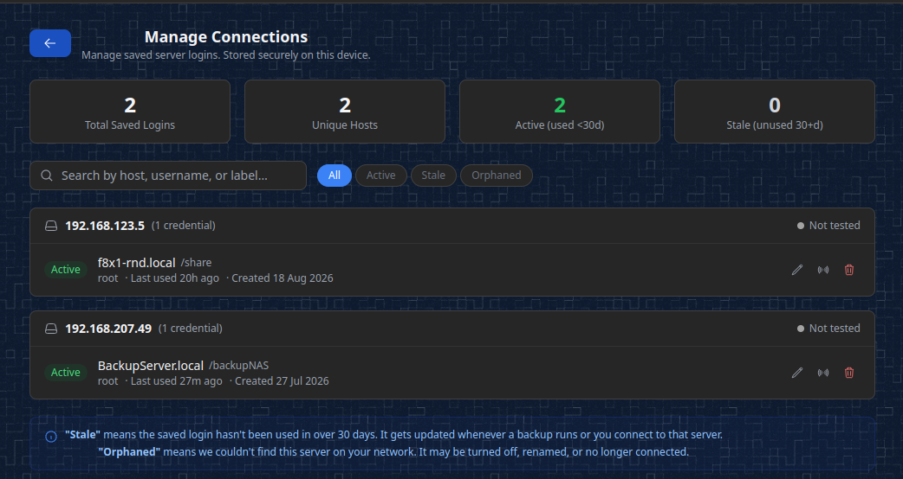
<!-- SCREENSHOT: The Manage Connections page showing the four summary counters across the top, the search box and the All / Active / Stale / Orphaned filter buttons, and two host groups expanded with several credential rows each. -->

Four counters sit at the top:

| Counter | Meaning |
|---|---|
| **Total Saved Logins** | Every credential stored |
| **Unique Hosts** | How many distinct servers |
| **Active (<30d)** | Used within the last 30 days |
| **Stale (30+d)** | Not used in over 30 days |

Search by host, username, or label, and filter by **All**, **Active**, **Stale**, or **Orphaned**. Credentials are grouped by host, with a reachability indicator per host and a per-credential status. The **⋯** menu on each row lets you manage that individual login.

**Clean N Stale** removes every credential that has not been used in 30 days or more.

> **Note:** Credentials never leave your computer. They are stored locally and used only to connect to your servers.

---

## 10. The Backup Manager

Open the Backup Manager from **Manage Backups** on the Dashboard, or **Backup Manager** in the menu. The first time you open it you see a welcome screen: *"Welcome to the Backup Manager."*

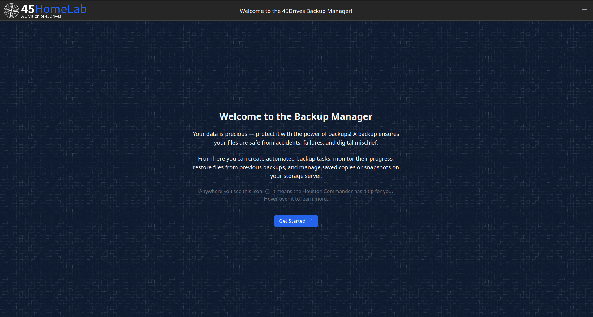
<!-- SCREENSHOT: The first-run Backup Manager welcome screen with the "Welcome to the Backup Manager" heading and its getting-started content. -->

The Backup Manager has two tabs, and understanding the difference is the key to the whole product:

| Tab | What it backs up | Where the schedule lives |
|---|---|---|
| **Local Backups** | Folders on **this computer** → a Samba share on your server | On this computer (cron / Task Scheduler / launchd) |
| **Remote Backups** | Data **on the server** → another server, a cloud provider, or another dataset | On the server (Task Scheduler) |

Use **Local Backups** to protect the laptop or workstation you are sitting at. Use **Remote Backups** to protect the server itself — including sending copies off-site.

A **Dashboard** button returns you to the main dashboard, and a gear icon opens Settings from either tab.

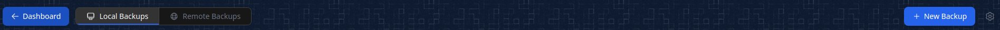
<!-- SCREENSHOT: Close crop of the Backup Manager header showing the Dashboard button, the Local Backups / Remote Backups segmented tab bar with Local active, the New Backup button on the right, and the Settings gear icon. -->

---

## 11. Local Backups — This Computer to the Server

On the **Local Backups** tab, click **New Backup** to open the four-step wizard.

### Step 1: Create Backup Task

*"Choose the folders you want to back up, pick a schedule, and we'll handle the rest."*

| Control | What to do |
|---|---|
| **Back Up Location** | Choose the destination share, shown as `\\ServerName\ShareName`. Click the refresh icon if your share is not listed yet. |
| **Schedule Type** | **Simple** gives every folder the same schedule. **Custom** gives each folder its own. |
| **Backup Interval** (Simple only) | **Hourly**, **Daily**, **Weekly**, or **Monthly**. Non-hourly schedules start at 12:00 AM (midnight). |
| **Folder Selection** | Click the **+** button and pick a folder to back up. |

In **Custom** mode each folder gets a calendar button so you can set its schedule individually.

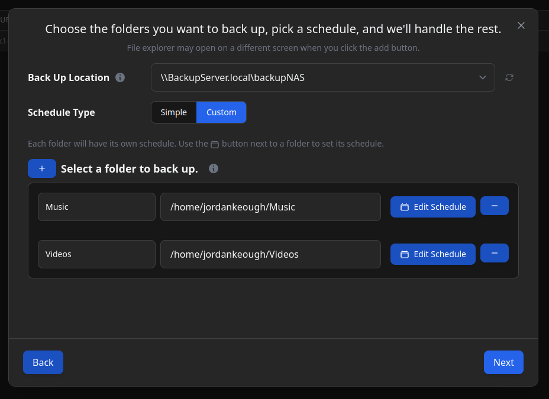
<!-- SCREENSHOT: The Create Backup Task step showing the Back Up Location dropdown (\\Server\Share) with its refresh icon, the Simple/Custom Schedule Type toggle, the Backup Interval dropdown, and two or three selected folders in the list with their name inputs, calendar and remove buttons. -->

Selected folders appear in a list. For each one you can type a friendly **backup name**, see the source path, open the **schedule editor**, or **remove** it.

The wizard prevents overlapping selections:

- *"This path is already added."*
- *"A subfolder of this folder is already added. Please remove it first."*
- *"A parent folder is already added. You cannot add a subfolder."*

> **Tip:** The file picker may open on a different monitor than the app window. If clicking **+** appears to do nothing, check your other screens.

**Next** stays disabled until at least one folder is selected.

### Step 2: Samba Login

*"Enter the Samba username and password for the backup share. If stored credentials are found, they'll be filled in automatically."*

The destination is shown as `\\ServerName\Share`. Enter the **Username** and **Password** for the Samba account that has write access to that share — this is the User Name and Password you created during Super Simple Setup.

If the credentials are wrong you will see *"Invalid credentials. Please check your username and password."*

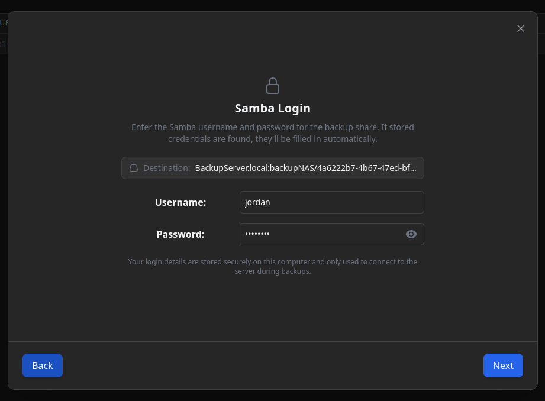
<!-- SCREENSHOT: The Samba Login step showing the lock icon and heading, the "Destination: \\ServerName\Share" line, the Username and Password fields with the eye toggle, and the credential-storage note. A second variant with the red "Invalid credentials" banner would be useful. -->

> **Note:** Your login details are stored securely on this computer and are used only to connect to the server during backups.

### Step 3: Summary

*"Review your backup configuration below. Click Next to proceed or Back to make changes."*

The screen lists the **Backup Location** and every **Backup Task** with its source folder, frequency, and next start time.

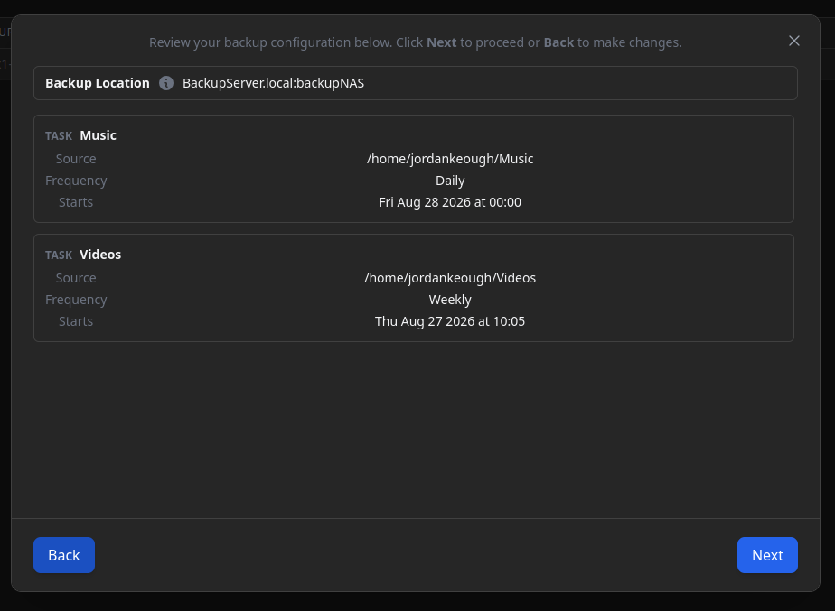
<!-- SCREENSHOT: The Summary step showing the Backup Location line and the scrollable list of task cards, each with Source, Frequency and Starts values, plus the OS-specific warning banner (Linux admin password or macOS Full Disk Access). -->

Platform-specific warnings appear here:

- **Linux:** If this is your first backup, you will be prompted for your admin password so the schedule can be installed.
- **macOS:** You will need to grant scheduled backups (cron) **Full Disk Access** in System Settings.

### Step 4: Congratulations

*"Complete! Your Backup Plan is Now Active."*

All tasks are configured and your data is now protected by scheduled backups.

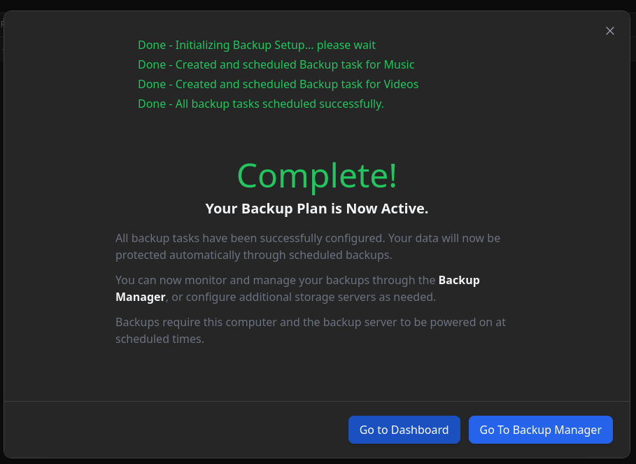
<!-- SCREENSHOT: The completion step showing the ticked progress steps, the "Complete! Your Backup Plan is Now Active." message, and the "Go to Dashboard" and "Go To Backup Manager" buttons. -->

> **Important:** Backups require both this computer and the backup server to be powered on at the scheduled times. A laptop that is asleep will not back up.

| Button | Destination |
|---|---|
| **Go to Dashboard** | The main dashboard |
| **Go To Backup Manager** | The task list |

### Managing Local Backup Tasks

The Local Backups tab shows a table of every task. The columns are **Name**, **User** (the Samba account), **Source**, **Destination**, **Freq**, **Status**, **Last Run**, **Next Run**, and an **Enabled** toggle. Drag the divider between two column headers to resize a column, and tick the checkbox in the header row to select every task at once.

Select one or more tasks to enable the action buttons:

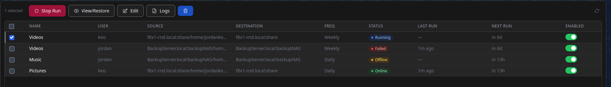
<!-- SCREENSHOT: The Local Backups tab with four or five tasks listed, one row selected so the Run Now / View-Restore / Edit / Logs / Delete action buttons are enabled, and the Refresh icon visible. -->

| Action | Description |
|---|---|
| **Run Now** | Runs the selected backup immediately instead of waiting for the schedule |
| **View/Restore** | Browses the files inside a backup and restores individual files or whole backups |
| **Edit** | Changes a task's name, source folder, schedule, or credentials. Enabled when exactly one task is selected. |
| **Logs** | Opens that task's run history |
| **Delete** (trash icon) | Removes the task |
| **Refresh** | Re-reads tasks from the system |

When no tasks exist you will see *"No backup tasks found"* and *"Click New Backup above to create your first backup task."*

While backups run, a progress panel appears at the bottom: *"N backups in progress"*, with a progress bar and percentage for each. Click the ✕ on a finished row to dismiss it.

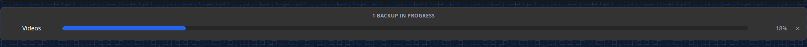
<!-- SCREENSHOT: The bottom progress panel showing two or three running backups, each with its name, a partially-filled progress bar, a percentage, and the ✕ dismiss button. Include one row with the indeterminate animated bar if possible. -->

---

## 12. Remote Backups — Server-Side Scheduled Tasks

Switch to the **Remote Backups** tab. These tasks run **on the server**, so they keep going whether or not your computer is on. This is where you set up server-to-server replication, cloud backups, and off-site copies.

### Two Toolbars

This tab shows two rows of controls, and knowing which is which saves confusion. The top row belongs to the desktop app. The row beneath it belongs to the Task Scheduler running on the server, displayed inside the app window.

| Toolbar | Controls |
|---|---|
| **Top (desktop app)** | **Dashboard**, the **Local Backups** / **Remote Backups** tabs, the server dropdown, **Connect**, **Disconnect**, **Forget**, **Restore**, **Snapshots**, and a **gear** at the far right |
| **Below it (Task Scheduler)** | **New Backup**, **Delete Tasks**, **Refresh**, a **gear**, and the **notification bell**. Selecting a task adds **Run Now**, **Stop**, **Logs**, **Edit**, and **Delete** to the left of this row. |

> **Important:** Both rows have a gear icon and they open different things. The **top** gear opens the desktop app's Settings — saved servers, display, connection, and log retention. The **lower** gear, beside the refresh icon, opens [Remote Backup Settings](#remote-backup-settings) with the retry and status-refresh options.

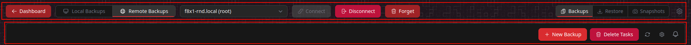
<!-- SCREENSHOT: The top of the Remote Backups tab with both rows visible and each gear icon called out — the upper row showing Dashboard, the two tabs, the server dropdown, Connect / Disconnect / Forget and Restore / Snapshots / gear, and the lower scheduler row showing New Backup / Delete Tasks / refresh / gear / bell. -->

### Connecting to a Server

| Control | What to do |
|---|---|
| **Select Server…** | Pick your server. Favorites appear in their own group above discovered servers. |
| **Connect** | Signs in and loads the server's backup tasks |
| **Disconnect** | Ends the session |
| **Forget** | Deletes the saved credential for this server |

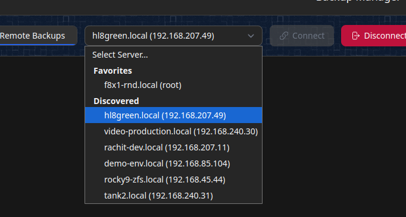
<!-- SCREENSHOT: The Remote Backups toolbar with the "Select Server…" dropdown open, showing a Favorites group above a Discovered group, and the Connect / Disconnect / Forget buttons beside it. -->

Clicking **Connect** opens a login dialog asking for **Username** and **Password**. You can also tick **Authenticate with SSH private key** and supply a key path and optional **Key Passphrase**.

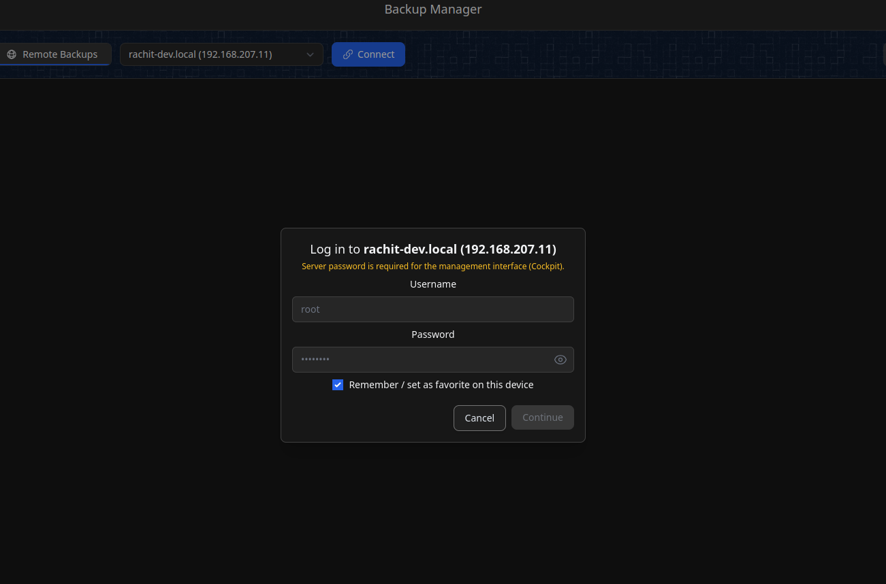
<!-- SCREENSHOT: The server login modal showing the Username and Password fields and the "Authenticate with SSH private key" section expanded with the key path field, Browse button and Key Passphrase field. -->

If no server is selected you will see *"Select a server above to view remote backups."*

> **Tip:** Turn on **Auto-connect favorites** in Settings → Network → Connection and your favourite server will connect the moment you pick it.

### The Backup Task List

Once connected, the server's backup tasks load into a table:

| Column | Contents |
|---|---|
| **Name** | The task name |
| **Type** | **Server-to-Server**, **Cloud Backup**, or **ZFS to ZFS Backup** |
| **Details** | Two lines showing **Source** and **Dest** paths |
| **Schedule** | A plain-English description of when it runs, or **—** if unscheduled |
| **Status** | A coloured dot — blue while running, red on failure, green on success, grey otherwise |
| **Last Run** | The last completion time, or *"Running now…"* |
| **Enabled** | A toggle that turns the schedule on or off. Disabled for tasks with no schedule. |

The footer summarises the list — for example *"6 tasks · 1 running · 2 disabled"*.

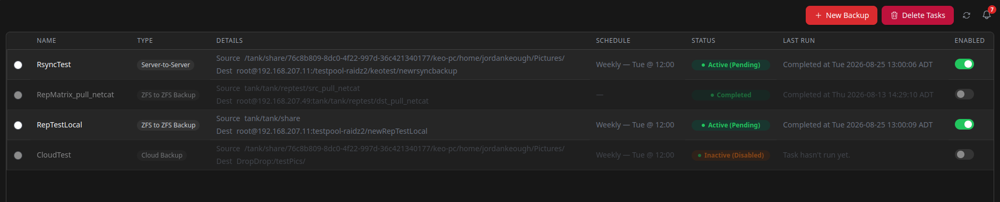
<!-- SCREENSHOT: The populated remote task table showing all columns — Name, Type badges (Server-to-Server, Cloud Backup, ZFS to ZFS Backup), the two-line Source/Dest details, plain-English Schedule text, coloured Status dots including one blue running task, Last Run values, and the Enabled toggles — with the footer summary line visible. -->

When there are no tasks: *"No remote backup tasks found"* and *"Click New Backup above to create one."*

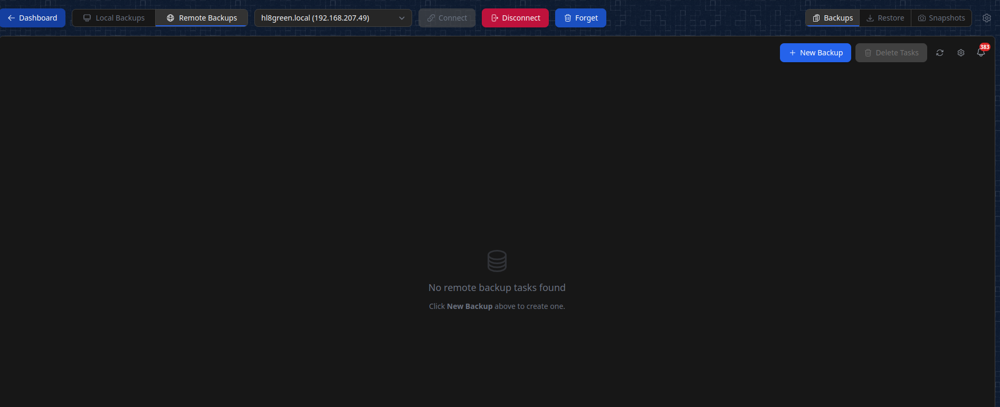
<!-- SCREENSHOT: The empty-state panel with the "No remote backup tasks found" heading and the "Click New Backup above to create one." hint. -->

### Creating a Backup Task

Click **New Backup**. The **Create Backup Task** screen has two columns: parameters on the left, schedule on the right.

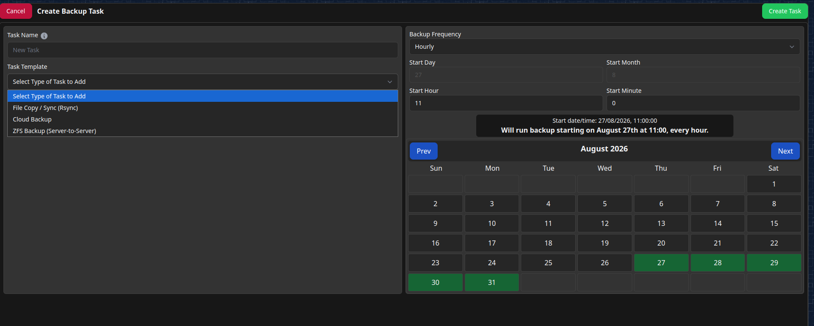
<!-- SCREENSHOT: The Create Backup Task screen in its two-column layout — left column with Task Name filled in and the Task Template dropdown open showing all three options, right column with the Schedule Task panel. -->

**Task Name** — letters, numbers, and underscores. Spaces are converted to underscores when you save. Names must be unique; the field turns red with a warning icon if the name is taken or invalid.

**Task Template** — choose the kind of backup you want.

### Choosing a Backup Type

| Type | Use it when | What it does |
|---|---|---|
| **File Copy / Sync (Rsync)** | Copying files to or from another server | Transfers files over SSH. Works with any Linux target, including one reached through a WireShield tunnel. |
| **Cloud Backup** | Sending data to a cloud provider | Syncs to Dropbox, Google Drive, S3, B2, Azure, and more, using a saved Cloud Account. |
| **ZFS Backup (Server-to-Server)** | Both servers use ZFS | The fastest and most faithful option. Only appears when local ZFS pools exist. |

Below the template selector, the **Parameters** section changes to match your choice. Each type presents its own set of cards.

#### Parameters — File Copy / Sync (Rsync)

**What do you want to copy?** — *"Choose a folder stored on this server that was created by a client backup. This is the backed-up copy of your files, not your live PC."*

| Field | What to do |
|---|---|
| **From (Source)** | A dropdown of folders your desktop app has already backed up to this server. A note reads *"Showing directories backed up to this server from your desktop app (SMB user: `<name>`)"*, and a line below shows the **Scope**, **Full Path**, and **User**. |
| **Enter path manually instead** | Tick this to swap the dropdown for a free-text path field. In manual mode the source must end with `/`. |
| **To (Target)** | Where the copy lands. End the path with `/` to copy the folder's *contents*, or leave it off to copy the folder itself. |

While the folder list loads you see *"Discovering your folders…"*. If discovery fails, the error appears with *"You can still type a path manually below."* and a **Retry** button.

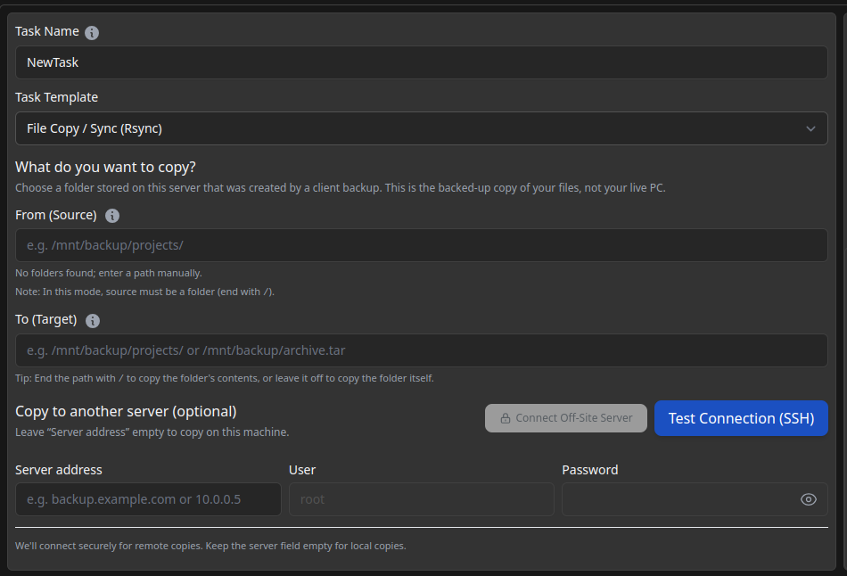
<!-- SCREENSHOT: The Rsync Parameters cards — "What do you want to copy?" with the From (Source) dropdown populated and the Scope / Full Path / User line beneath it, the To (Target) path field, and the "Copy to another server (optional)" card below showing the Server address, User and Password fields with the Connect Off-Site Server and Test Connection (SSH) buttons in its header. -->

**Copy to another server (optional)** — *"Leave 'Server address' empty to copy on this machine."*

| Field | What to do |
|---|---|
| **Server address** | The destination server's hostname or IP — for example `backup.example.com` or `10.0.0.5`. Leave blank for a local copy. |
| **User** | The SSH account. Defaults to `root`. Disabled until you enter a server address. |
| **Password** | That account's password, with an eye icon to reveal it. Disabled until you enter a server address. |

Two buttons sit in this card's header:

| Button | What it does |
|---|---|
| **Connect Off-Site Server** | Opens WireShield to build an encrypted tunnel to a server at another location |
| **Test Connection (SSH)** | Verifies the credentials. Reads **Testing…** while it runs. |

The first time you point a task at a tunnelled server, a **First-time setup** panel asks for that account's password so the two servers can exchange SSH keys — *"This is a one-time step — your servers will use SSH keys for all future connections."* Until it completes, the card footer warns *"SSH login must be configured before remote copies can work."*

#### Parameters — Cloud Backup

**What do you want to copy?** — the same folder picker as Rsync, labelled **Local folder**, with the same manual-path checkbox and *"Discovering your folders…"* / **Retry** behaviour.

**Choose your cloud account** — *"Pick an existing account or add a new one."* Pick a saved account from the **Cloud account** dropdown and its provider logo appears beside it. **Add/Manage Cloud Accounts** opens the [Cloud Accounts](#13-cloud-accounts) screen.

**How should we transfer?** — three radio options:

| Option | Behaviour |
|---|---|
| **Copy** | Add/update files; don't delete at destination |
| **Sync** | Make destination match source (may delete extras) |
| **Move** | Copy then remove from source after success |

> **Warning:** **Sync** deletes files at the destination that no longer exist at the source, and **Move** removes them from the source after a successful transfer. Use **Copy** unless you specifically want that behaviour.

**Where do you want to copy it to?** — *"Choose where it will live in the cloud."* Type the **Cloud folder** path inside the selected account, for example `my-bucket/backups/`.

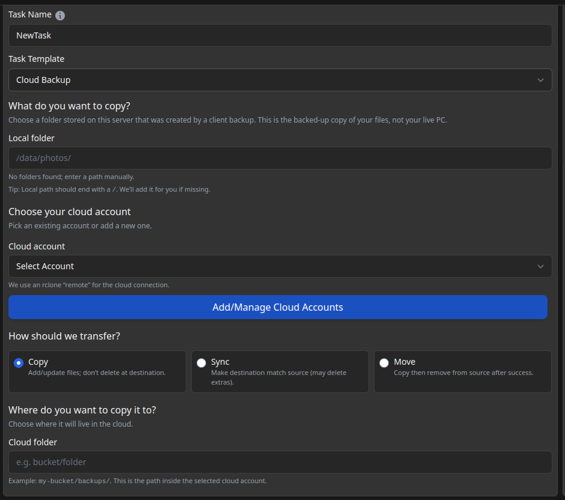
<!-- SCREENSHOT: The Cloud Backup Parameters cards stacked — "What do you want to copy?" with the Local folder dropdown, "Choose your cloud account" with an account selected and its provider logo plus the Add/Manage Cloud Accounts button, "How should we transfer?" with the three Copy / Sync / Move radio tiles and their descriptions, and "Where do you want to copy it to?" with the Cloud folder field filled in. -->

#### Parameters — ZFS Backup (Server-to-Server)

When you pick the ZFS template, an information panel explains:

> **ZFS Backup** uses ZFS replication to send only the changes (incremental snapshots) since the last backup — much faster than copying everything each time. It also preserves exact file permissions, timestamps, and metadata. Recommended when both servers use ZFS storage.

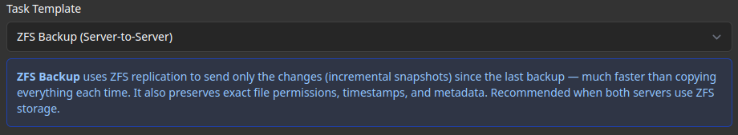
<!-- SCREENSHOT: The blue "ZFS Backup" information callout shown after selecting the ZFS template, with its full explanatory text. -->

**Which folder do you want to back up?** — *"Pick the ZFS pool and dataset (folder) on this server that you want to protect."* Choose a **Pool**, then a **Dataset (Folder)**.

**Where should the backup go?** — *"Enter the backup server details and pick the destination ZFS pool and dataset."* Fill in **Server address**, **User**, and **Port**, then choose the **Destination Dataset**. This card carries the same **Connect Off-Site Server** and **Test Connection (SSH)** buttons in its header.

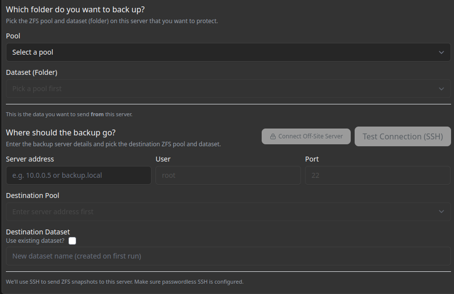
<!-- SCREENSHOT: The ZFS Parameters cards — "Which folder do you want to back up?" with the Pool and Dataset (Folder) dropdowns, and "Where should the backup go?" with the Server address / User / Port fields, the Destination Dataset picker, and the Connect Off-Site Server and Test Connection (SSH) buttons in the header. -->

> **Tip:** If the destination server is at another location, use the **Connect Off-Site Server** button to set up a WireShield link first. See [Off-Site Backups with WireShield](#14-off-site-backups-with-wireshield).

### Setting the Schedule

The right-hand **Schedule Task** panel controls when the task runs.

**Backup Frequency** — **hourly**, **daily**, **weekly**, or **monthly**.

The fields shown depend on the frequency:

| Frequency | Fields |
|---|---|
| **Hourly** | Start Hour (0–23), Start Minute (0–59) |
| **Daily** | Start Month, Start Hour, Start Minute |
| **Weekly** | Weekday (Sun–Sat), Start Hour, Start Minute |
| **Monthly** | Start Day (1–31), Start Month, Start Hour, Start Minute |

A preview below the fields confirms your choice in plain language — for example *"Will run backup every Monday at 14:00."* — along with the exact first start date and time.

An interactive month calendar highlights the days the task will run in green. Use the **Prev** and **Next** buttons to look ahead.

New tasks default to **hourly**, starting at the top of the next hour.

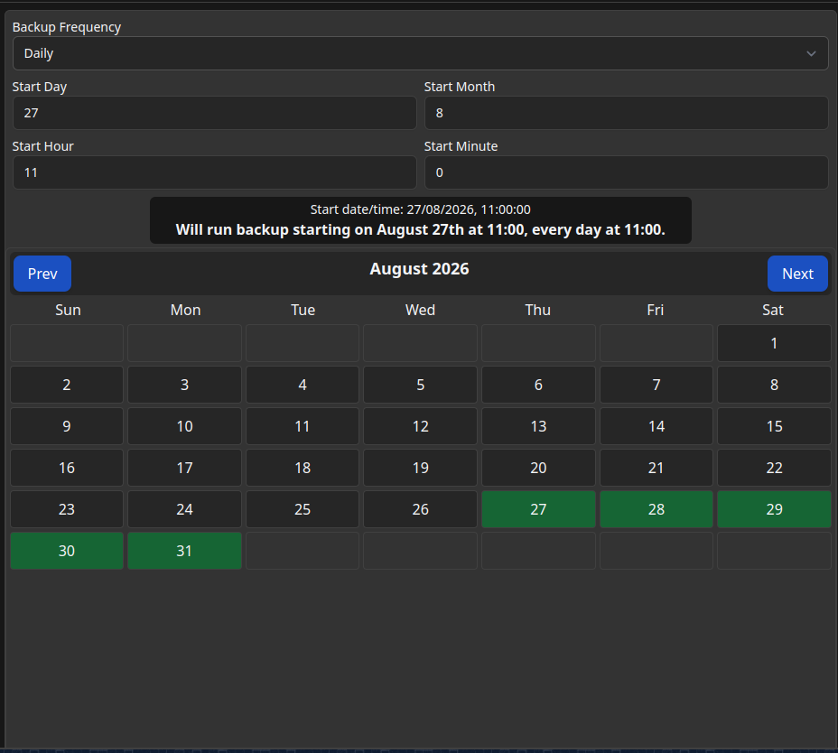
<!-- SCREENSHOT: The Schedule Task panel with Backup Frequency set to weekly, the Weekday / Start Hour / Start Minute fields filled in, the plain-English preview line ("Will run backup every Monday at 14:00.") and first-start date, and the month calendar below with the matching days highlighted green and the Prev / Next buttons visible. -->

> **Note:** If you pick a day that does not exist in a given month (for example the 31st in February), you will see *"Selected day is invalid for this month. Adjusted to last valid day."*

Click **Create Task** to save. The button reads **Creating…** while it works.

### Running, Stopping, and Watching Progress

Select a task in the list to enable the action buttons.

| Button | Behaviour |
|---|---|
| **Run Now** | Confirms *"Do you wish to run this task now?"*, then starts the task immediately. Status changes to running and Last Run shows *"Running now…"*. |
| **Stop** | Only appears for a running task. Confirms *"Do you wish to stop this task now?"* |

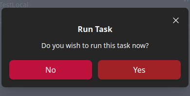
<!-- SCREENSHOT: The "Run Task" confirmation dialog with the text "Do you wish to run this task now?" and its confirm / cancel buttons. -->

When a task finishes you get a notification:

- **Task Successful** — *"Task `<name>` completed."*
- **Task Failed** — *"Task `<name>` failed (exit code X)."*

While tasks are running, a progress strip appears at the bottom of the list: *"N backups in progress"*, with a progress bar per task showing a phase label and percentage — for example *"Uploading — 45.3%"*. Tasks that cannot report a percentage show an animated bar and *"Running…"*.

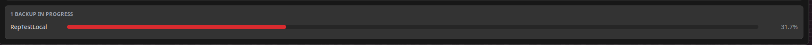
<!-- SCREENSHOT: The "N backups in progress" strip at the bottom of the remote task list, showing one task with a phase label and percentage (e.g. "Uploading — 45.3%") and another with the indeterminate animated bar reading "Running…". -->

### Editing, Disabling, and Deleting Tasks

**Edit** opens the same form pre-filled with the task's current settings. The heading reads **Edit Backup Task** and the save button reads **Save Changes**, which stays disabled until you actually change something.

**Enabled toggle** turns a schedule on or off without deleting the task:

- Turning it on: *"Schedule Enabled — '`<name>`' schedule is now active."*
- Turning it off: *"Schedule Disabled — '`<name>`' will no longer run on schedule."*

**Delete** (trash icon) removes a single task after confirming *"Are you sure you want to remove this task? This cannot be undone."*

**Delete Tasks** switches the list into batch mode. Checkboxes replace the selection radio buttons and a header checkbox selects all. Choose your tasks and click **Delete (N)**. You will be asked to confirm: *"Are you sure you want to delete N tasks? This will stop and remove each task."* Progress is shown as *"Deleting (2/5)…"*, and the result is reported when it finishes.

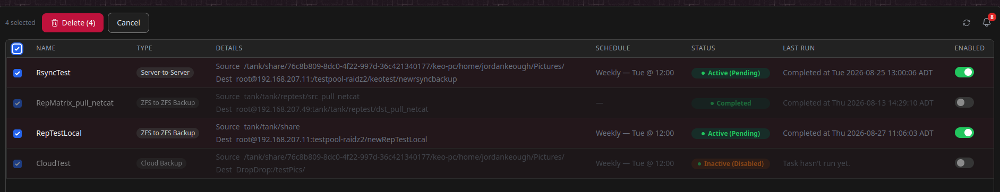
<!-- SCREENSHOT: The remote task list in batch-delete mode showing per-row checkboxes, the select-all header checkbox, three rows ticked, and the "Delete (3)" button enabled. -->

### Viewing Logs

Select a task and click **Logs** to open its execution history — every run with its timestamp, status, and output. This is the first place to look when a backup fails.

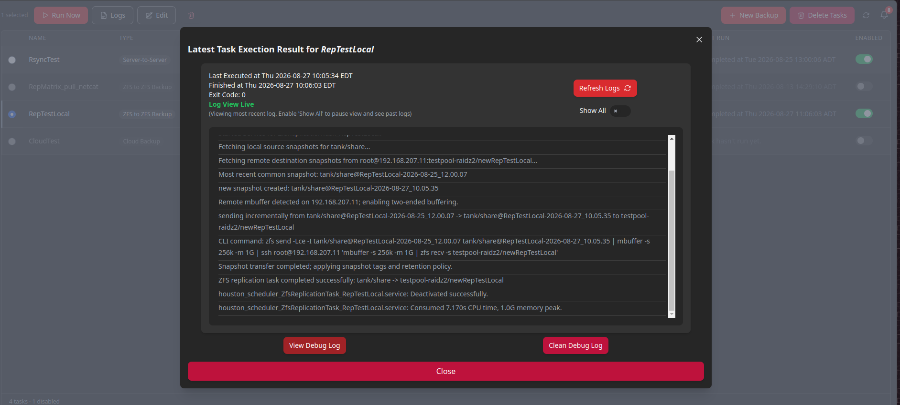
<!-- SCREENSHOT: The log viewer modal for a remote task showing several run entries with timestamps, status labels, and expanded command output including at least one failure. -->

### Remote Backup Settings

Click the gear icon in the **lower** toolbar — the Task Scheduler row, beside the refresh icon — to open **Settings**. Hovering it shows a **Settings** tooltip. (The gear at the far right of the *top* toolbar opens the desktop app's own Settings instead.)

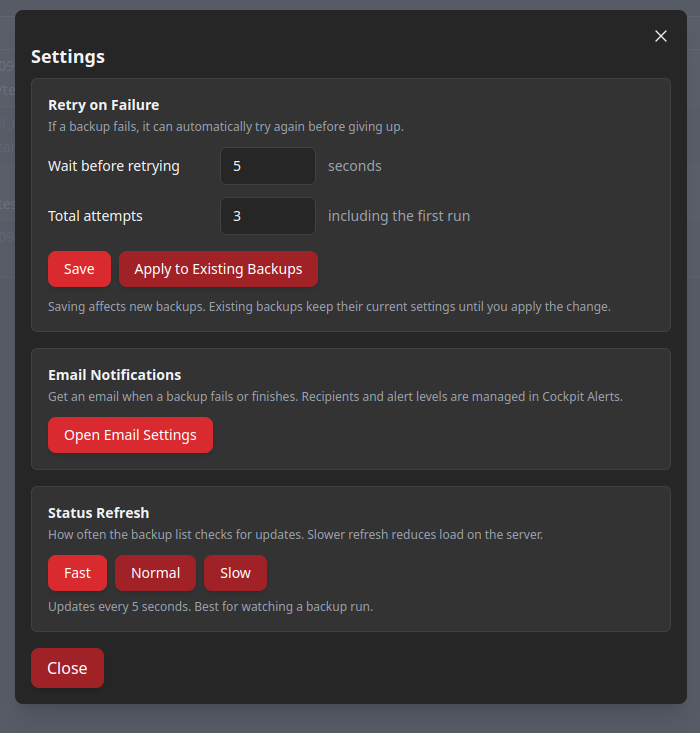
<!-- SCREENSHOT: The remote backup Settings modal showing the Retry on Failure section with its two fields and the "Apply to Existing Backups" button, and the Status Refresh Fast / Normal / Slow presets with Normal selected. -->

**Retry on Failure** — *"If a backup fails, it can automatically try again before giving up."*

| Field | Range | Default |
|---|---|---|
| **Wait before retrying** | 1–300 seconds | 5 seconds |
| **Total attempts** | 1–10, including the first run | 3 |

Click **Save** to apply these to new backups. Existing backups keep their current settings until you click **Apply to Existing Backups**, which reports how many tasks were updated.

**Status Refresh** — *"How often the backup list checks for updates. Slower refresh reduces load on the server."*

| Preset | Refresh rate | When to use |
|---|---|---|
| **Fast** | Every 5 seconds | Best for watching a backup run |
| **Normal** | Every 15 seconds | Recommended for most setups |
| **Slow** | Every 30 seconds | Lightest load on the server |

Click **Close** when you are done.

---

## 13. Cloud Accounts

Before you can create a **Cloud Backup** task, you need a saved cloud account. Open **Cloud Accounts** from the task parameters.

The left panel, **Your accounts**, lists everything you have saved, with a provider logo, the account name, and the provider type. A search box filters the list. Click **Add** to create a new one.

The right panel starts with *"Select an account on the left to manage it, or click Add to create a new one."*

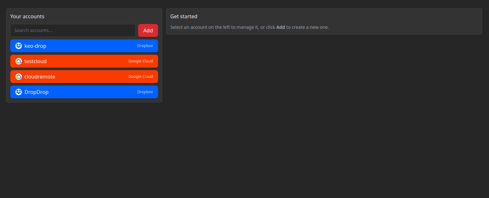
<!-- SCREENSHOT: The Cloud Accounts screen with the left "Your accounts" panel listing three saved accounts (each with its provider logo, account name and provider type), the search box and Add button, and the right panel showing the "Select an account on the left…" empty message. -->

### Supported Providers

**Quick sign-in (OAuth)** — these link with a browser sign-in and require no keys:

| Provider |
|---|
| **Dropbox** |
| **Google Drive** |
| **Google Cloud Storage** |

**Advanced: more providers** — expand this section for providers that need credentials:

| Provider | Credentials you will need |
|---|---|
| **Microsoft Azure Blob** | Account name and key, or SAS URL |
| **Backblaze B2** | Account ID and application key |
| **Amazon S3** | Access Key ID, Secret Access Key, region |
| **Wasabi** | Access Key ID, Secret Access Key, endpoint, region |
| **Ceph** | Access Key ID, Secret Access Key, endpoint |
| **IDrive e2** | Access Key ID, Secret Access Key, endpoint |
| **Storj** | Access grant, or satellite address, API key, and passphrase |

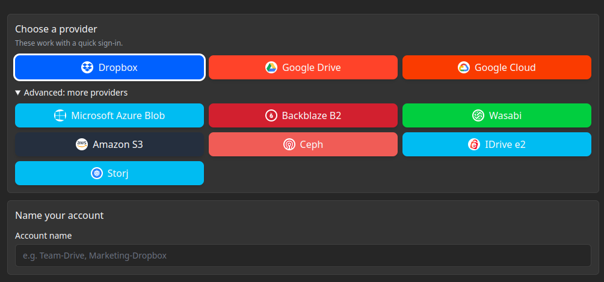
<!-- SCREENSHOT: The "Choose a provider" step showing the three quick sign-in tiles (Dropbox, Google Drive, Google Cloud) with their logos, and the "Advanced: more providers" section expanded below showing the remaining provider tiles (Azure Blob, Backblaze B2, Amazon S3, Wasabi, Ceph, IDrive e2, Storj). -->

### Adding an Account with Sign-In (OAuth)

1. Click **Add**.
2. Under **Choose a provider**, pick **Dropbox**, **Google Drive**, or **Google Cloud**.
3. Under **Name your account**, type a name you will recognise — for example `Team-Drive` or `Marketing-Dropbox`.
4. Click **Authenticate with `<Provider>`**. A sign-in window opens. If it is slow to appear you will see *"Authenticating… A sign-in window should open shortly."*
5. Sign in and approve access. The button changes to **Reset OAuth** once linked.
6. Click **Save Account**.

Privacy Policy and Terms of Service links are provided beside the sign-in button.

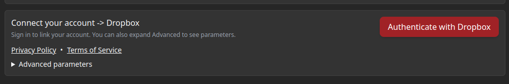
<!-- SCREENSHOT: The "Connect your account" panel with Dropbox selected, the account name field filled in, the "Authenticate with Dropbox" button, the Privacy Policy and Terms of Service links, and the Save Account button. -->

> **Note:** If your browser blocks the pop-up, allow pop-ups for the app and try again.

### Adding an Account with Keys

1. Click **Add**, then expand **Advanced: more providers**.
2. Pick your provider and give the account a name.
3. Expand **Advanced** to reveal the parameter fields and fill in your credentials.
4. Click **Save Account**. **Clear** resets the form.

For S3-compatible providers, a **provider** dropdown selects the flavour — AWS, Wasabi, MinIO, Ceph, or Other — which sets the correct defaults.

### Editing and Removing Accounts

Select an account on the left. The right panel shows **Account details** (name and provider) and **Authentication**.

| Button | What it does |
|---|---|
| **Edit** | Unlocks the fields for changes |
| **Reconnect** | Re-runs the OAuth sign-in |
| **Reset OAuth** | Clears the stored token |
| **Save Changes** | Saves your edits |
| **Cancel Edit** | Discards changes |
| **Delete** | Removes the account |

Expand **Show parameters** to inspect or change the raw provider settings.

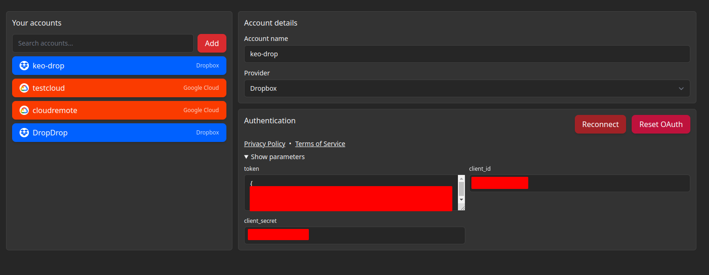
<!-- SCREENSHOT: A selected cloud account in edit mode showing the Account details fields, the Authentication section with Reconnect and Reset OAuth, the expanded "Show parameters" list, and the Save Changes / Cancel Edit / Delete buttons. -->

---

## 14. Off-Site Backups with WireShield

### What WireShield Does

WireShield builds a private, encrypted **WireGuard** tunnel between two servers at different locations. Once the tunnel is up, the remote server behaves exactly like a server on your local network — you point a backup task at its tunnel IP address and everything travels encrypted across the internet.

You need WireShield whenever the backup destination is **not** on the same local network.

Pairing uses a **6-character code**. One server creates the code, the other enters it, and the tunnel comes up. There are no long keys to copy and no configuration files to edit.

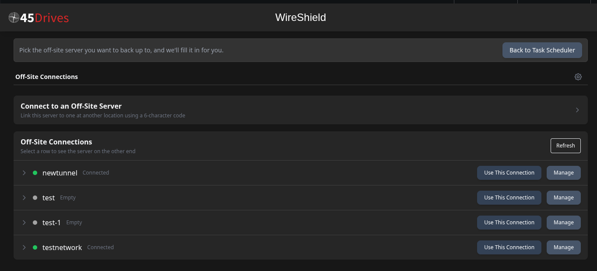
<!-- SCREENSHOT: The WireShield simple view showing the "Off-Site Connections" page heading, the collapsed "Connect to an Off-Site Server" panel, and the "Off-Site Connections" list below it with one green Connected row, its Manage button, and the Refresh button. -->

The page heading in this view is **Off-Site Connections**, with a gear icon in the header that opens WireShield's own settings. Everything you need is on this one page: a collapsible **Connect to an Off-Site Server** panel at the top, and the list of existing connections below it.

> **Note:** A small 45Drives coordination service acts as a matchmaker. It helps the two servers discover each other's public address and exchange keys, then steps out of the way. **Your backup data never passes through it** — traffic flows directly between your two servers. You do not need to configure anything about this service.

### Before You Start — Ports and Firewalls

Each tunnel listens on its own UDP port. WireShield assigns the first free port starting at **51820** and counting upward, so your first tunnel is usually 51820, the next 51821, and so on. Ports are reused when a connection is removed, so the number you are given will not always be the next one in sequence — the pre-flight check tells you exactly which port this tunnel will use.

WireShield tries to open that port automatically through your router using UPnP, which works on most home and office networks. If it cannot, an amber notice appears once you run [Check This Server](#check-this-server):

> **This server may not be reachable from the internet.** We could not open a path through your router automatically. If the other server is **not** on this same network, ask whoever manages your firewall or router to forward **UDP port `<port>`** to this server. Each tunnel requires its own port to be forwarded.
>
> You can still continue — pairing usually works without this when both servers are on the same local network.

The same notice stays visible on the connection-code and enter-a-code screens, so the port number is always in front of you while you pair.

**To forward the port manually:**

1. Log into your router's admin page (often `192.168.1.1` or `192.168.0.1`).
2. Find **Port Forwarding** or **NAT**.
3. Create a rule using the port number shown in the notice: external port **`<port>`**, internal IP **your server's LAN IP**, internal port **`<port>`**, protocol **UDP**.
4. Save and retry.

> **Tip:** Only **one** of the two servers needs to be reachable from the internet. If your office server has a forwarded port, the remote site can sit entirely behind NAT.

### Check This Server

Expand **Connect to an Off-Site Server** and click **Check This Server** before pairing. The button changes to **Checking…**, and a status word appears beside it:

| Status | Colour | Meaning |
|---|---|---|
| **Ready** | Green | This server can pair |
| **Needs Attention** | Amber | Something needs fixing first |

A detail box below the button explains the result. In the **Ready** state you will see one of two messages:

- *"Ready to pair. Your router allows the connection automatically — no setup needed."* — the best case; the port was opened for you.
- *"Ready to pair. WireShield will negotiate a path through your router during pairing, which works on most home and office networks."* — the port could not be opened in advance. The amber [port forwarding notice](#before-you-start--ports-and-firewalls) appears below this box with the exact UDP port to forward if pairing does not finish.

**Needs Attention** messages include:

| Message | What to do |
|---|---|
| *"Could not reach pairing coordinator"* | Check the server's internet connection and outbound firewall rules. |
| *"Pairing coordinator is rate-limiting requests"* | Wait a minute and check again. |
| *"This server is not enrolled with the pairing service"* | You can usually continue — WireShield registers the server automatically. |
| *"Could not determine public IP"* | The server cannot see its own public address. Check the internet connection. |
| A WireGuard kernel module message | WireGuard is not loaded on the server. Follow the hint shown in the message. |

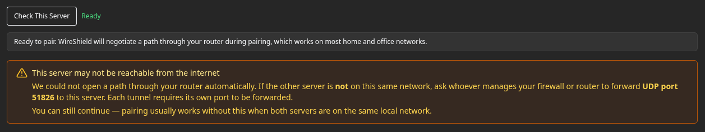
<!-- SCREENSHOT: The "Check This Server" button with the green "Ready" label beside it and the detail box below showing the ready-to-pair message, with the amber port-forwarding notice directly underneath. A second variant showing the amber "Needs Attention" label with a failure message would also be useful. -->

### Pairing Two Servers

You will do this **twice** — once on each server. Start with whichever server is easier to reach.

**Opening WireShield**

From a backup task's parameters, click the **Connect Off-Site Server** button. This saves your in-progress task and opens WireShield.

When you arrive this way, a banner appears at the top of WireShield:

> Pick the off-site server you want to back up to, and we'll fill it in for you. **[Back to Task Scheduler]**

That banner is your way back. WireShield remembers the task you were editing, so nothing is lost.

> **Note:** The app's **Server Management → Network** tab can also start pairing via its **New Tunnel** button. That opens the app's own tunnel dialog rather than the WireShield view described here — see [VPN Tunnels](#vpn-tunnels).

Expand **Connect to an Off-Site Server** — *"Link this server to one at another location using a 6-character code."*

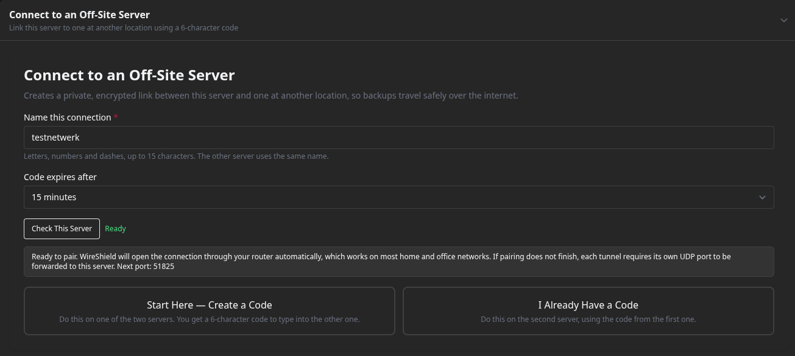
<!-- SCREENSHOT: The expanded "Connect to an Off-Site Server" panel showing the "Name this connection" field filled with "offsite-backup", the "Code expires after" dropdown, and the two mode buttons — "Start Here — Create a Code" and "I Already Have a Code" — with their descriptions. -->

**On the first server — create the code**

1. In **Name this connection**, type a name such as `offsite-backup`. Letters, numbers, and dashes, up to 15 characters.
2. Set **Code expires after** — 15 minutes, 30 minutes, 1 hour, or 2 hours.
3. Click **Start Here — Create a Code**. The button reads **Creating Code…** while it contacts the pairing service.
   > *"Do this on one of the two servers. You get a 6-character code to type into the other one."*
4. The **Your Connection Code** screen appears:
   > *"Go to the other server, open WireShield, choose "I Already Have a Code", and type this in."*

   It shows a large 6-character code — for example `ABC123`. Click **Copy Code** to copy it; the button changes to **Copied**.
5. A countdown appears: *"Waiting for the other server to connect — code expires in 3:45 (at 14:32)."*

Leave this screen open. **Cancel** abandons the code if you change your mind.

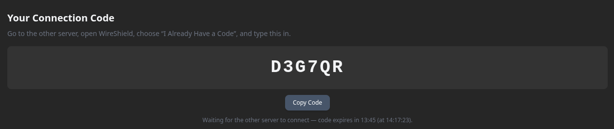
<!-- SCREENSHOT: The "Your Connection Code" screen with the instruction line, the large 6-character code in monospace, the Copy Code button, the "Waiting for the other server to connect — code expires in M:SS (at HH:MM)" countdown line, and the Cancel button. -->

**On the second server — enter the code**

1. Open WireShield on the second server and expand **Connect to an Off-Site Server**.
2. Click **I Already Have a Code**.
   > *"Do this on the second server, using the code from the first one."*
3. Type the 6-character code into the large input field. It converts to uppercase automatically.
   > *"Type the 6-character code shown on the other server. The connection is named automatically to match it."*

   You do **not** need to type the connection name on this side — it is copied from the first server for you.
4. Click **Connect** (or press Enter). The button reads **Connecting…**.

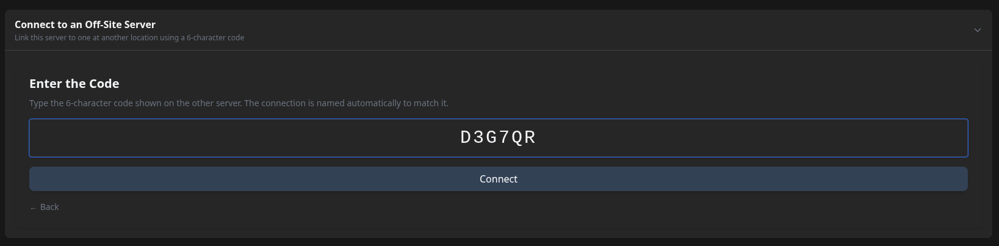
<!-- SCREENSHOT: The "Enter the Code" screen with its instruction line, the large centred uppercase input showing a partially typed code (placeholder is ABC123), the Connect button, and the ← Back link. -->

**Both servers**

A spinner appears with *"Setting up the secure connection…"*, then a green checkmark:

> **Connected** — "The two servers are now linked. This connection comes back automatically after a reboot."

Click **Done** to return.

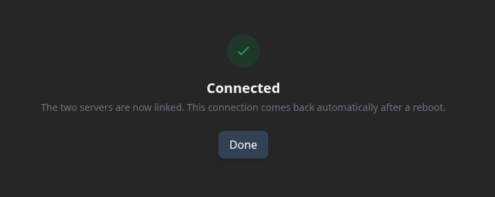
<!-- SCREENSHOT: The success screen with the large green checkmark, the "Connected" heading, the "The two servers are now linked…" message and the Done button. A second capture of the "Setting up the secure connection…" spinner state would also be useful. -->

> **Note:** The tunnel is enabled at boot on both servers, so it survives reboots and power outages without any action from you.

> **Tip:** Each tunnel gets its own private `/24` subnet from the `10.45.0.0/16` range. The server that created the code takes the `.1` address and the server that joined takes `.2` — so a first tunnel is typically `10.45.0.1` and `10.45.0.2`.

### Managing Off-Site Connections

The **Off-Site Connections** section lists every tunnel. *"Select a row to see the server on the other end."*

Each row shows a status dot, the connection name, a health label, and a count such as *"1 server on the other end"*:

| Dot | Label | Meaning |
|---|---|---|
| Green | **Connected** | The tunnel is up and traffic is flowing |
| Amber | **Partially Connected** | Some peers are reachable, others are stale |
| Red | **Disconnected** | No recent handshake |
| Grey | **Empty** | The tunnel exists but nothing has joined it yet |

> **Note:** **Empty** is normal right after you create a code on the first server — the connection stays empty until the second server joins.

Click a row to expand it. The first line is **This server** with this end's tunnel address (such as `10.45.0.1`). Below it is each server on the other end, showing its name, its tunnel IP, and traffic counters — *"Received 1.4 MB · Sent 801.0 KB"*. If nothing has joined yet you will see *"Nothing connected on the other end yet."*

> **Note:** Remote servers are usually listed under an automatically generated name like `peer-4PaQvxUb`, derived from that server's public key. If the server reported a hostname during pairing, that is shown instead. A server with no name at all appears as **Other server**.

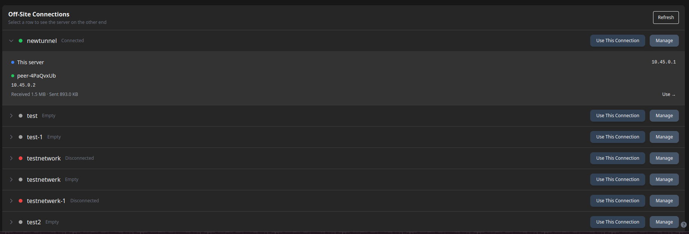
<!-- SCREENSHOT: The Off-Site Connections list with one row expanded, showing the green dot and "Connected" label, the "N servers on the other end" count, the "This server" line with its 10.45.0.1 address, and a peer row with its auto-generated peer-XXXXXXXX name, tunnel IP and "Received … · Sent …" counters. -->

**Refresh** re-checks status; it reads **Refreshing…** while it works. When there are no tunnels at all: *"No off-site connections yet — Use 'Connect to an Off-Site Server' above to link another server."*

**Manage** opens a modal titled *"Manage `<connection name>`"*:

| Control | What it does |
|---|---|
| **Status** | The same health label as the list row, or **Unknown** |
| **Servers on the other end** | How many peers have joined |
| **Remove** (per server) | Removes that server from the connection |
| **Reconnect** | Restarts the tunnel — the first thing to try if a connection goes amber or red. Reads **Working…** while it runs. |
| **Remove Connection** | Deletes the tunnel entirely |

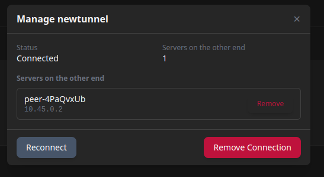
<!-- SCREENSHOT: The "Manage offsite-backup" modal showing the Status and "Servers on the other end" count at the top, the "Servers on the other end" list with one peer, its tunnel IP and its red Remove button, and the Reconnect and Remove Connection buttons in the footer. -->

### Using the Tunnel in a Backup Task

If you opened WireShield from a backup task, you do not need to copy any addresses by hand. While the *"Pick the off-site server you want to back up to"* banner is showing:

- Click **Use This Connection** on a connection row, or
- Expand the row and click the server you want — each peer row becomes clickable and shows a **Use →** hint.

Either way, WireShield hands the tunnel IP back to the Task Scheduler and returns you to the Backup Manager, where your in-progress task is restored with the remote host already filled in. Set your schedule and save.

If you opened WireShield some other way, expand the connection, note the remote server's **tunnel IP** (for example `10.45.0.2`), and type it into the task's remote host field yourself. The destination is then treated exactly like a server on your own LAN.

From that point on, every run of the task travels through the encrypted tunnel. Nothing else about the task changes.

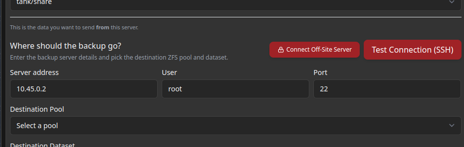
<!-- SCREENSHOT: Two-part capture — first the WireShield list in select mode showing the "Use This Connection" button and an expanded peer row with the "Use →" hint, then the remote backup task Parameters panel with the remote host field auto-filled with the tunnel IP. -->

> **Tip:** Every tunnel also appears on the Dashboard's **Topology Map**, which is the quickest way to confirm at a glance that your off-site link is live.

---

## 15. Restoring Data

### Restoring from a Local Backup

On the **Local Backups** tab, select a task and click **View/Restore**. This opens the backup browser, where you can navigate the backed-up folder structure and restore individual files or entire folders back to this computer.

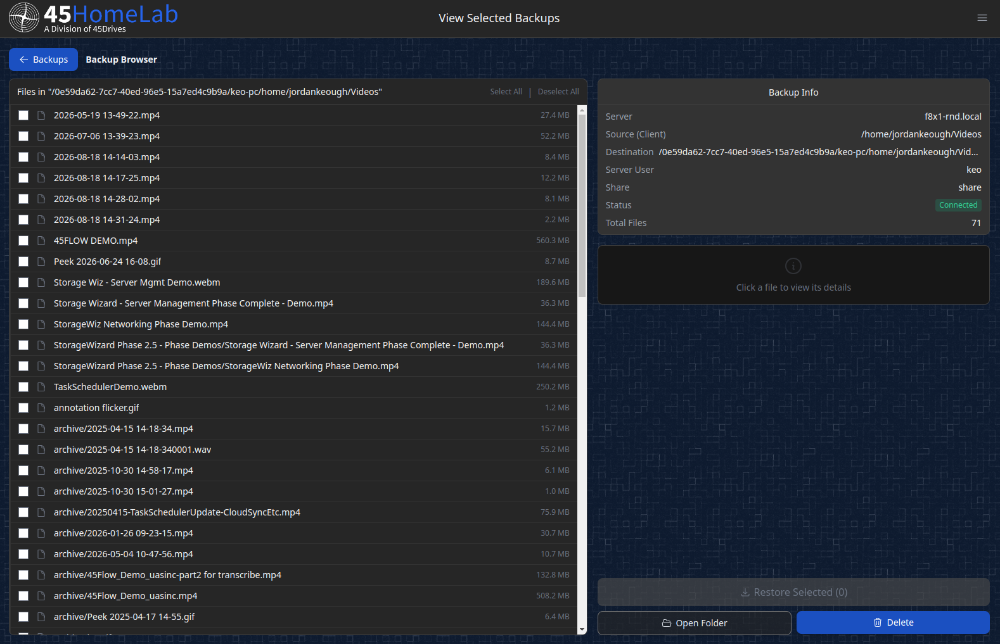
<!-- SCREENSHOT: The local backup file browser opened from View/Restore, showing the backed-up folder tree, a breadcrumb path, and several files selected ready to restore. -->

### Restoring from a Remote Backup

On the **Remote Backups** tab, connect to your server and click **Restore**. The button changes to **Return to Backups** so you can toggle back.

**Choose a source**

| Source | Then pick |
|---|---|
| **Server Backups** | A backup task from the dropdown. Each entry shows its direction — `→ host:path` for pushes, `← host:path` for pulls. |
| **Cloud Backups** | A cloud account from the dropdown |

**Browse the files**

The left panel lists files and folders. Click a folder to open it, use the `..` row to go up, and use the breadcrumb trail at the top to jump back several levels. Click the **Name** header to change sort order.

**Select All** and **Deselect All** work on the current folder, and a badge shows how many items you have selected.

If nothing appears you will see a prompt such as *"Select a backup task to browse remote files."* or *"No files found at this location."*

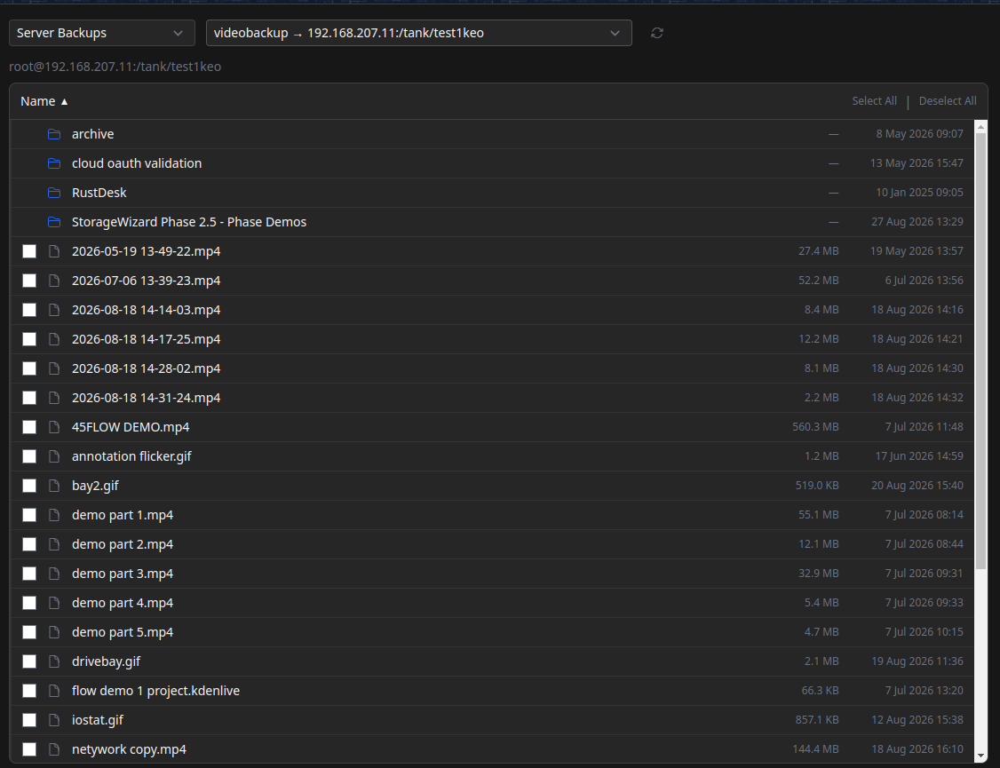
<!-- SCREENSHOT: The Restore view showing the source dropdown (Server Backups / Cloud Backups), the backup task picker with a "→ host:path" entry, the breadcrumb trail, and the file list with the `..` row, several items ticked, the Select All / Deselect All buttons and the selected-count badge. -->

**Choose where to restore**

The right panel is **Restore Destination**:

| Option | Details |
|---|---|
| **Restore to Server** | Puts the files back on the server. Tick **Restore to original path** to use the location they came from, or type a **Server destination path** such as `/data/restored`. Optionally tick **Create folder if it doesn't exist** and **Create as ZFS dataset** (which asks for a **Parent dataset**, for example `tank/data`). |
| **Download to this Computer** | Saves the files locally. Click **Browse** to choose a **Download to** folder. |

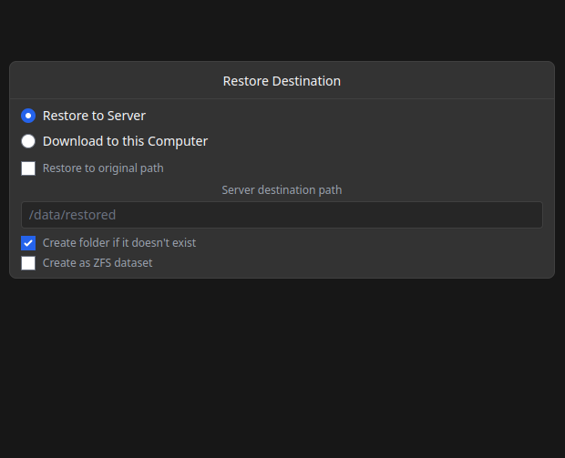
<!-- SCREENSHOT: The Restore Destination panel with "Restore to Server" selected, the "Restore to original path" checkbox unticked so the Server destination path field is visible, and the "Create folder if it doesn't exist" and "Create as ZFS dataset" options shown with the Parent dataset field. -->

Start the restore. Progress is shown as *"Restoring…"* and then *"Restore Complete"*. A **Cancel** button is available while it runs, and any failure is reported with the error.

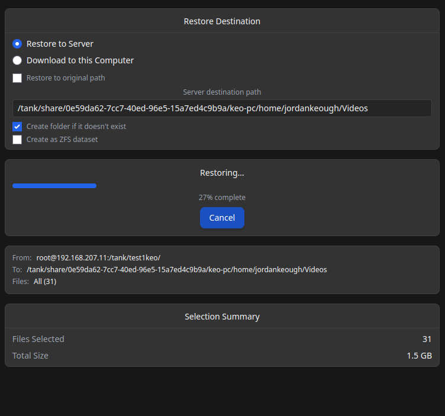
<!-- SCREENSHOT: The restore progress state showing the "Restoring…" label, a progress bar and the Cancel button. A second capture of the "Restore Complete" success state would also be useful. -->

### Snapshots

On the **Remote Backups** tab, click **Snapshots** to open the snapshot manager. This is where ZFS point-in-time copies live — including the hourly, daily, and weekly snapshots created automatically when you enabled **Split Pools** during setup.

The left panel lists your **Datasets**. Select one to see its snapshots. Each snapshot offers three actions:

| Action | What it does |
|---|---|
| **Browse files** | Opens the snapshot's contents so you can pull individual files out of it |
| **Rollback** | Reverts the entire dataset to that point in time |
| **Delete** | Removes the snapshot |

Snapshots that serve as replication anchors are marked, and hovering over the marker shows which tasks depend on them.

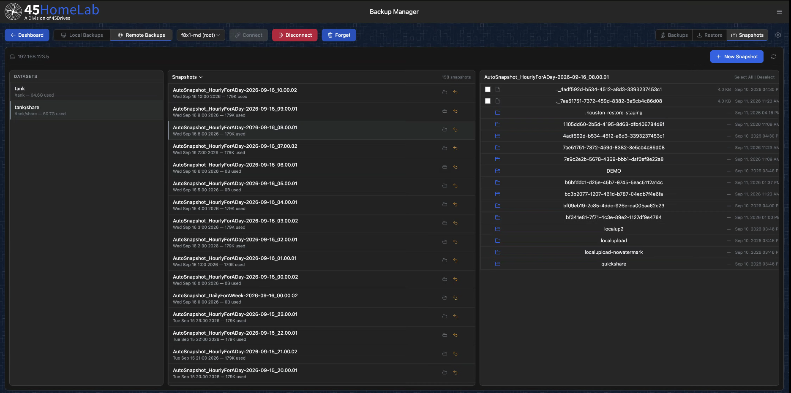
<!-- SCREENSHOT: The snapshot manager with the Datasets list on the left, one dataset selected, and its snapshots listed on the right with timestamps and the Browse files / Rollback / Delete icons. Include at least one snapshot showing the replication-anchor marker. -->

> **Warning:** **Rollback** discards every change made after the snapshot was taken. If you only need a few files, use **Browse files** instead.

> **Note:** Snapshots that anchor a replication task should not be deleted — removing them forces the next replication to send everything from scratch.

---

## 16. Automatic Updates

The Storage Wizard updates itself. Roughly five seconds after startup it checks for a new release, downloads it in the background, and installs it the next time you quit the app. You will be notified when an update is ready.

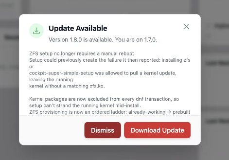
<!-- SCREENSHOT: The in-app notification telling the user an update has been downloaded and will install when the app quits. -->

Updates are disabled while running a development build. Pre-release versions are never installed automatically.

To update the **server** components (Super Simple Setup, Task Scheduler, WireShield), use your server's normal package manager, or re-run the Setup Wizard connection step which refreshes the installed packages.

---

## 17. Viewing Logs

Open **View Logs** from the menu, or **Logs** from Quick Actions. The page is titled **Log Viewer** — *"View logs from the local client app and connected servers."*

Passwords, tokens, and other secrets are automatically redacted before anything is written to disk.

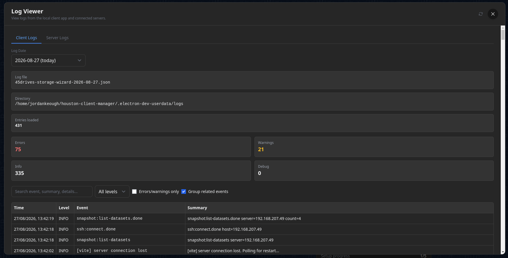
<!-- SCREENSHOT: The Log Viewer on the Client Logs tab, showing the "Log Viewer" heading and subtitle, the Refresh icon and Back button, the Client Logs / Server Logs tab bar, and a mix of info, warning and error entries with timestamps. -->

Two tabs split the view:

| Tab | What it shows |
|---|---|
| **Client Logs** | This desktop app's own activity — discovery, SSH connections, backup scheduling, restores, and errors |
| **Server Logs** | Log files pulled from a connected server |

On the **Server Logs** tab, a connection bar appears above the output:

| Control | What to do |
|---|---|
| **Server** | Pick which server to pull logs from |
| **Source** | Choose *All server logs*, *setup-module.log*, or *easysetup-\*.log* |
| **Fetch Server Logs** | Retrieves the logs. Reads **Fetching…** while it works. |

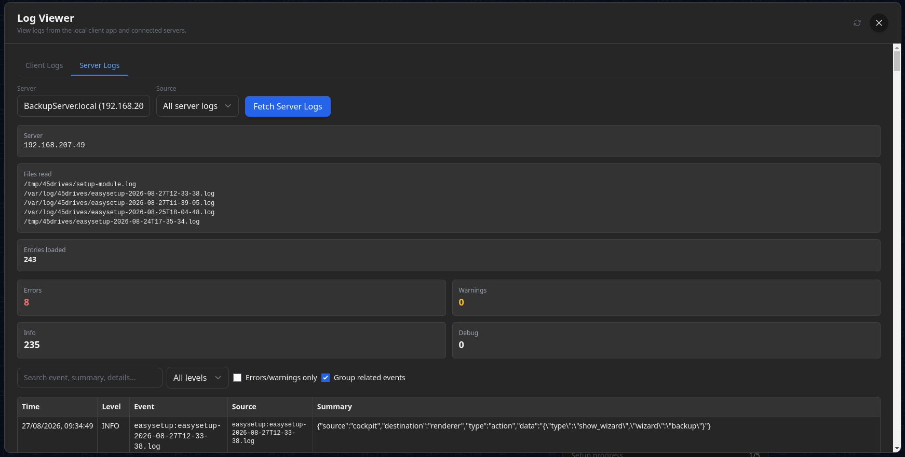
<!-- SCREENSHOT: The Log Viewer on the Server Logs tab, showing the Server dropdown, the Source dropdown expanded with its three options, and the Fetch Server Logs button. -->

The **Refresh** icon in the header re-reads the current view, and **Back** returns you to where you came from.

For a specific backup task:

- **Local Backups:** select the task and click **Logs**
- **Remote Backups:** select the task and click **Logs**

Log retention is controlled in **Settings → System → Advanced → Log retention**.

---

## 18. Frequently Asked Questions

**What is the difference between Local Backups and Remote Backups?**
Local Backups copy folders from *this computer* to a share on your server, and the schedule lives on this computer. Remote Backups run *on the server* and copy server data to another server or to the cloud — they keep running whether or not your computer is on.

**Do I need to leave my computer on for backups to run?**
For **Local Backups**, yes — both this computer and the server must be powered on at the scheduled time. For **Remote Backups**, no; the server handles everything itself.

**My server does not appear in the discovery dropdown.**
Wait a minute after powering on and click **Rescan Servers**. If it still does not appear, enter the IP address in **Connect manually via IP**, and turn on **Fallback network scan** in Settings → Network → Connection. Automatic discovery uses mDNS, which some networks block.

**Should I choose Simple or Custom setup?**
Choose **Simple**. It applies 45Drives' best practices based on the drives you installed and produces a fully production-ready server. Use **Custom** only when you need a specific RAID level, extra datasets, multiple shares, or additional user accounts.

**What does "Split Pools" actually give me?**
It divides your drives into a Storage pool and a Backup pool on the same machine. The Backup pool holds a replicated copy of your Storage pool, refreshed by hourly, daily, and weekly snapshots. It costs you roughly half your usable capacity but protects against accidental deletion and drive failure. It requires at least 6 drives.

**Is Split Pools the same as an off-site backup?**
No. Split Pools protects against drive failure and mistakes, but both copies are in the same chassis. For protection against fire, theft, or flood you need an off-site copy — use a **Remote Backup** task over a **WireShield** tunnel, or a **Cloud Backup**.

**Which backup type should I use for a second server?**
If both servers run ZFS, use **ZFS Backup (Server-to-Server)** — it sends only incremental changes and preserves permissions and metadata exactly. Otherwise use **File Copy / Sync (Rsync)**.

**Do I have to open ports for WireShield?**
Only one side needs to be reachable. Each tunnel uses its own UDP port, assigned from 51820 upward, and WireShield tries to open it automatically via UPnP. Click **Check This Server** to see the exact port it will use. If UPnP fails and both servers are behind NAT, forward that port on one of them. Servers on the same local network usually pair without any port forwarding.

**Does my backup data pass through 45Drives' servers?**
No. The coordination service only helps the two servers find each other and exchange keys during pairing. All backup traffic flows directly between your servers through the encrypted tunnel.

**Does the tunnel survive a reboot?**
Yes. WireShield enables the tunnel at boot on both servers.

**Where are my passwords stored?**
Server logins are stored securely on your own computer and never leave it. You can review, filter, and clean them up from **Manage Connections**.

**I forgot my server password. Can I recover it?**
No. The setup wizard warns you to record your Server Name, Network Folder Name, Username, Password, and root password because they cannot be retrieved afterwards. You would need physical or console access to the server to reset the account.

**Can I set up several servers at once?**
Yes — use **Setup Multiple Servers** for Bulk Server Setup, and export a template so you can reuse the same configuration next time.

**Does the app update itself?**
Yes. It checks for updates shortly after launch, downloads them in the background, and installs on quit.

---

## 19. Troubleshooting

| Symptom | What to check |
|---|---|
| **Server not discovered** | Confirm the Ethernet cable goes to a router or switch, not directly to your computer. Click **Rescan Servers**. Enter the IP manually. Enable **Fallback network scan** in Settings. |
| **Setup Wizard says installation failed** | Expand the **Troubleshooting steps** section on that screen. Verify the username has root or sudo rights, and that the password is correct. |
| **Setup finished but the server is unreachable** | If you changed the Server Name, the server reboots to finalise the hostname change. Wait a minute and reconnect using the new name or the IP. |
| **Drives missing from the drive view** | Power the server down, reseat the drives, and power back on. The drive view refreshes every few seconds, so missing drives will reappear on their own once seated. |
| **"Cannot proceed with errors" on the drive step** | Read the **Issues** panel. Common causes are mismatched drive capacities and drives reporting health warnings. |
| **Split Pools checkbox is greyed out** | You need at least 6 drives so both pools keep redundancy. |
| **Local backup fails with invalid credentials** | Re-check the Samba username and password. These are the User Name and Password you created during Super Simple Setup, not your computer's login. |
| **Local backups never run on macOS** | Grant cron **Full Disk Access** in System Settings → Privacy & Security. |
| **Local backups never run on Linux** | The first backup requires your admin password to install the schedule. Re-run the wizard and supply it when prompted. |
| **Remote backup task fails** | Select the task and click **Logs**. Check that the destination path exists and that the remote user has write permission. |
| **Cloud sign-in window never opens** | Allow pop-ups for the app and click **Authenticate with `<Provider>`** again. |
| **WireShield says "Needs Attention"** | Read the reported reason. Most often the server cannot reach the pairing coordinator — check the server's internet access and DNS. |
| **Pairing code expired** | Codes expire after the timeout you chose. Click **Cancel** and create a new code. |
| **Tunnel shows amber or red** | Open **Manage** on that connection and click **Reconnect**. If it stays down, run **Check This Server** to find the tunnel's UDP port and confirm it is forwarded on at least one side. |
| **Backup over the tunnel is slow** | Confirm the task targets the tunnel IP (for example `10.45.0.2`) and not a public address, and check the traffic counters in the expanded connection view to confirm data is moving. |
| **Backup list feels sluggish** | In Remote Backup Settings, set **Status Refresh** to **Slow** to reduce load on the server. |
| **Something looks wrong in the UI** | Open **Settings → Client → Display** and click **Reset guided tours** to replay the walkthroughs, or check **View Logs** for errors. |

---

*45Drives Storage Wizard — © 45Drives. For support, contact your 45Drives representative or visit [45drives.com](https://www.45drives.com).*
